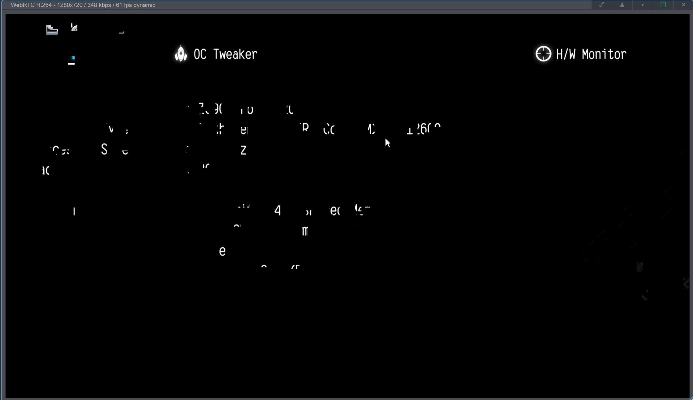
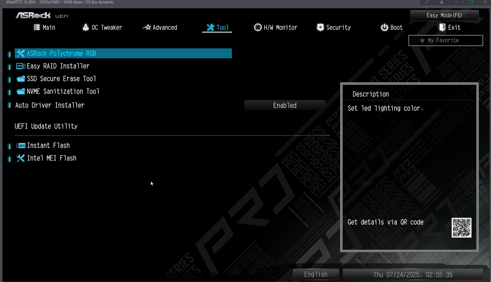

This tutorial is mostly for my reference in case for when I forget how to fix this issue in the future. But I will try to be as beginner friend as much as possible.

If you are seeing glitchy or wrong BIOS/UEFI resolution in your PiKVM session, like the following screenshot, follow the steps below the picture!


1. First, if you haven't tried the official troubleshooting steps, you should try that. [Here](https://docs.pikvm.org/faq/) is the link to that, and scroll down to the "Glitchy or wrong BIOS/UEFI resolution" section in that page. However, those steps didn't work for me. Fortunately, I have figured out a way to fix this!
1. After you log on to your PiKVM session, select "Terminal".
1. Run ```su-```, and enter in your password.
1. Run ```rw``` to enter Read-Write mode.
1. Run ```nano /etc/kvmd/tc358743-edid.hex``` to edit the tc358743-edid.hex config file that contains information about the video modes supported by the video capture device. 
1. Replace the content in the file with the following. For transparency's sake, this is an EDID (Extended Display Identification Data) for a 1920x1080 display, and it is taken from [here](https://docs.pikvm.org/edid/#restore-default-edid). 
    ```
    00FFFFFFFFFFFF005262888800888888
    1C150103800000780AEE91A3544C9926
    0F505425400001000100010001000100
    010001010101D32C80A070381A403020
    350040442100001E7E1D00A050001940
    3020370080001000001E000000FC0050
    492D4B564D20566964656F0A000000FD
    00323D0F2E0F000000000000000001C4
    02030400DE0D20A03058122030203400
    F0B400000018E01500A0400016303020
    3400000000000018B41400A050D01120
    3020350080D810000018AB22A0A05084
    1A3030203600B00E1100001800000000
    00000000000000000000000000000000
    00000000000000000000000000000000
    00000000000000000000000000000045
    ```
1. Save the file by pressing ```Ctrl``` and ```X``` at the same time, type ```y```, and press ```Enter```.
1. Run ```kvmd-edidconf --apply``` to apply the changes.
1. Run ```ro``` to switch to Read-Only mode.
1. Check the stream to check whether your BIOS/UEFI is displayed correctly in PiKVM. If not, restart the host, not the device running PiKVM. Hopefully your BIOS/UEFI is finally being displayed correct on your PiKVM like the following screenshot. If not, you can always undo these changes and restore the default EDID by running the commands below the screenshot.


```
rw
kvmd-edidconf --import-preset=v1 --apply # for PiKVM v1
ro
```
You can change the ```v1``` to ```v0```, ```v1```, ```v2```, ```v3```, ```v4mini``` and ```v4plus``` depending on your hardware.
