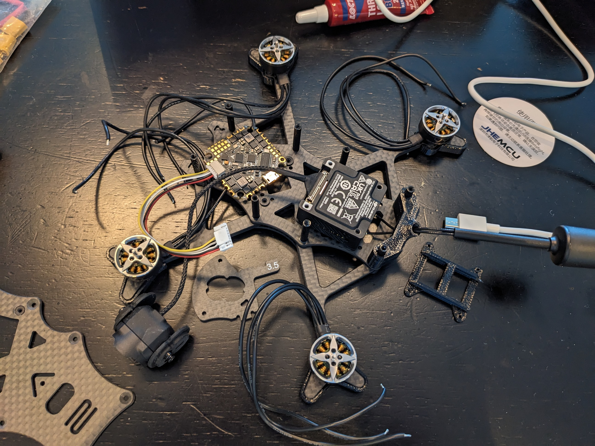
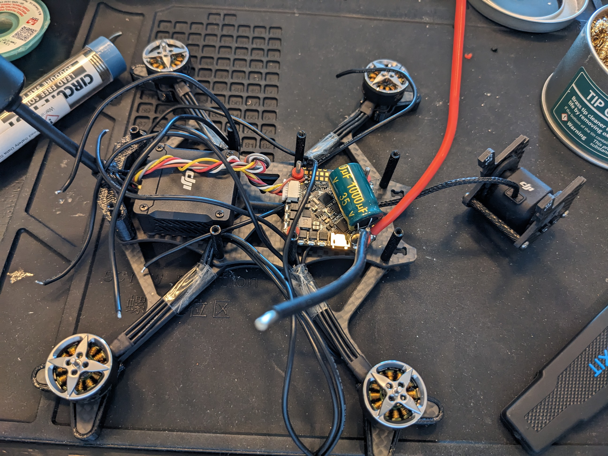
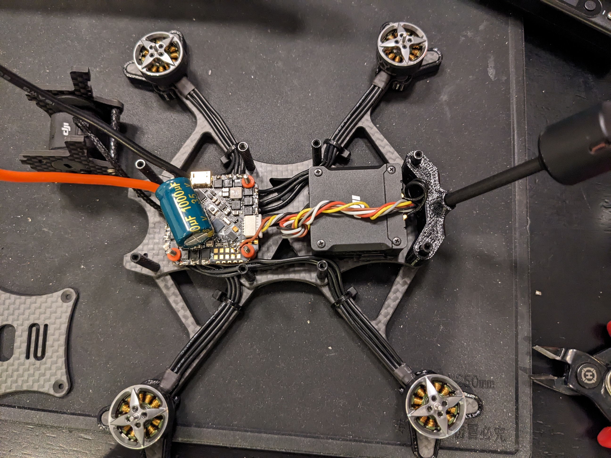
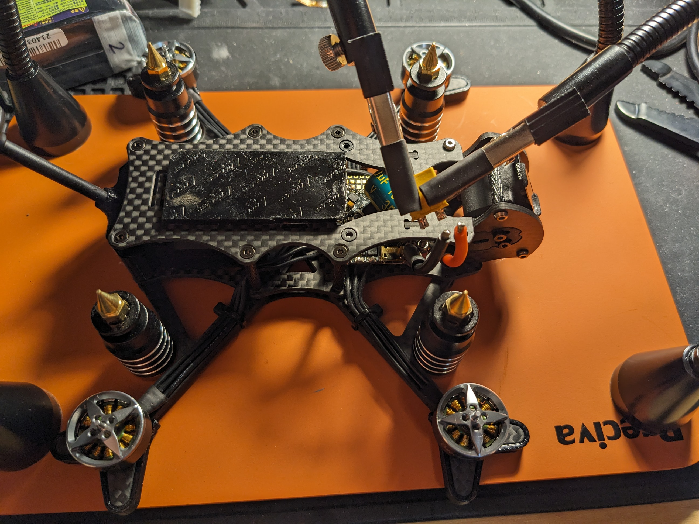
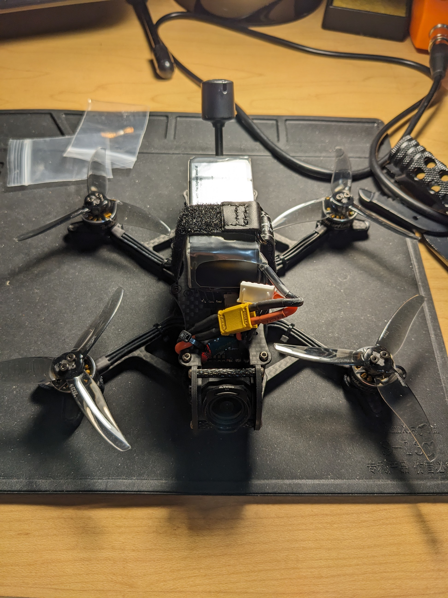

## Introduction

I am not sure exactly when the idea to build an FPV drone first hit me, though I think it started with [an MKBHD video](https://www.youtube.com/watch?v=syiQmaGZFXM&t=108s) showcasing the DJI FPV drone, which led me into the rabbit hole of FPV drones. Seeing those FPV pilots fly was unlike anything I had seen before. The way they controlled their drones looked like an extension of their own body, effortless, so much freedom, like they were birds in the sky with remarkable agility. That is the origin of me looking into getting my own.

After getting my first drone, the DJI FPV drone, I inevitably crashed it. [But I repaired it](https://marcusc.me/projects/dji-fpv-drone-repair/). But that repair never quite sat right with me and it does not fly the way it was before, probably because it was my first time soldering. It could be just in my head, but that feeling eventually manifested into wanting to build my own instead.

And that is what I did over the summer of 2023.

## Parts I used:

- Frame: AOS 3.5 EVO
- Flight controller: JHEMCU GHF405 Pro AIO, an F4 FC with a 25A 3-6S BLHeli_S ESC built onto the same board
- Motors: BrotherHobby VY 1504.5, 2950KV
- Propellers: HQProp T3.5X2.5X3, 3.5 inch tri-blade
- Video transmitter: DJI O3 Air Unit, digital, doubles as the camera and the radio link
- Battery: TATTU R-Line 750mAh, 4S

The plan was a sub 250 gram, 3.5 inch quad. Staying under 250 grams keeps it classed as a [microdrone under Transport Canada's rules](https://tc.canada.ca/en/aviation/drone-safety/learn-rules-you-fly-your-drone/drone-operation-categories-pilot-certificates/microdrones), which means no registration or pilot certificate. I decided to go with 3.5 inch props after reading the AOS 3.5 EVO page (no longer up but [this](https://www.aos-rc.com/designs/aos-3.5-v5) is the updated one). Chris Rosser's (who owns that website) argument came down to a simple idea, how much weight each propeller actually has to lift.[^1] Bigger props push more air for the same input power compare to smaller props, so a quad with props that are relatively small for its weight has to consume more power just to stay in the air, which shows up as less punch and mushier control. Run that math for a 250 gram build and 3.5 inch props come out close to ideal for that weight, which is the frame I ended up building around. Small enough to be nimble, light enough to sit in the easier weight class, and fast enough to actually feel fast.

[^1]: The technical term for this is disc loading, the drone's weight divided by the total area the propellers sweep through as they spin. Lower disc loading generally means a more efficient, more responsive quad.

I sourced and assembled everything myself, but most of the parts here came straight off Chris Rosser's AOS 3.5 recommended build page. That exact page is not up anymore, but AOS keeps a current version of it at [aos-rc.com/recommended-parts/3in-freestyle](https://www.aos-rc.com/recommended-parts/3in-freestyle).

## Snippets of the build process:

Motors mounted on the bare frame.

DJI O3 Air Unit and Flight Controller roughly positioned on the frame.

DJI O3 Air Unit and Flight Controller mounted on the frame.

Fully wired, no top plate yet.

Top plate on.

Final step: soldering the XT30 connector.

What a beauty!

## Tuning the PID controller

I got lucky here. Instead of tuning from scratch, I loaded Chris Rosser's PID profile onto the FC, a preset a lot of the FPV community swears by, and the quad felt responsive right out of the gate. I did very little manual tuning on top of it.

## Wrapping up

I did fly it hard, many times, but I never crashed it badly enough to break anything. Then, in a plot twist, I pulled the DJI O3 camera off it and put it in a rocket instead, planning to stream and record the view going up at supersonic speed. That did not work out, so that is a story for another day, or maybe never.

I really want to build another one to rip around in real life. For now I am just practicing in sims.