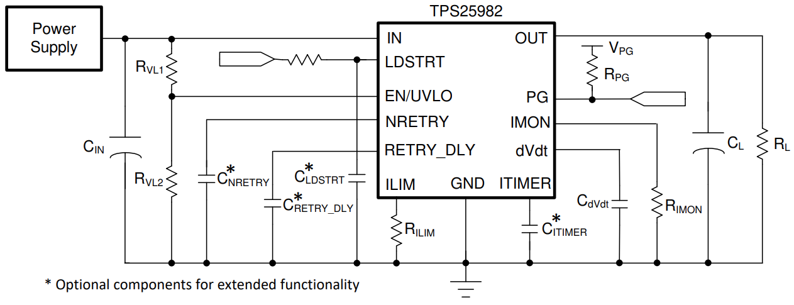

## Introduction

My teammate, [Andi](https://www.linkedin.com/in/andili/) and I designed and currently validating our team's first battery management system. We called our system battery happy system because our first generation board doesn't support offically charging (safely). It only keep our battery happy by monitoring and cutting power for scenario of overcurrent/short circuit and undervoltage/over discharged.

As mentioned in my last [project](/projects/radio-pcb) at my time at UBC Rocket, I switched to using Altium designer. I found the transition much less daunting compared to when I was learning how to use Altium designer before I design my first PCB. 

## Features:

### Overcurrent/short circuit detection:
- We will be using the TPS25982 e-fuse IC, and follow mostly from (reference) circuit in the TPS25982 datasheet below for this feature.
- Parameters such as the current limit and undervoltage lockout point can be changed by adjusting the resistors or capacitor values according to the formulas in the datasheet.
- One of the MCU I/O is connected to EN/UVLO 
- The MCU will connect to the IMON pin to get the voltage that is used to compute the current.

| **RVL1** | **RVL2** | **RILIM** | **RIMON** | **RPG** | **CIN** | **CNRETRY** | 
|:--------:|:--------:|:---------:|:----------:|:-------:|:-------:|:-----------:|
|    N/A   |    N/A   |   3.74k   |    1.65k   |   100k  |   0.1u  |     OPEN    |

|**CRETRY_DLY** | **CITIMER** | **CdVdt** | **LDSTRT** |
|:--------------:|:-----------:|:---------:|:----------:|
|       GND      |     OPEN    |    GND    |     GND    |

### ~~Current sense circuit:~~ 
This is included in the over-current detection circuit.
1. ~~Place a shunt resistor (resistor with very low resistance, ~mΩ) in series with the battery.~~
2. ~~Measure the voltage across the shunt resistor.~~
3. ~~Since the resistance is very low, the voltage across it would also be low. Therefore, we need an amplifier to amplify the voltage. We are going to use ...~~
4. ~~Find the current using ohms law and divide by the gain.~~

### ~~Undervoltage/over-discharge protection:~~ 
This is included in the MCU & voltage sense circuit
- ~~We will be using the BQ296230 IC, and the following (reference) circuit from the BQ296 datasheet below for this feature.~~
- ~~If the battery is < 4s, then we need to jump V pins that are floating to the next V pin that is connected to a battery cell.~~
- ~~This IC is not available with JLCPCB, so we will hand solder this.~~

### Voltage sense circuit:
- The microcontroller measures the voltage from each cell (3V to 4.2V for Li-ion, and 3.2V to 4.2V for Li-Po)
- The microcontroller adds up the cell voltages to get the total series voltage. 

### MCU:
- The VCC input of the ATTINY404 microcontroller would be connected to the VOUT of the voltage regulator.
- [Programmable](1) it via [UPDI](2)

## Finished PCB schematic & layout

## Fresh from JLCPCB!

[1]: https://www.electronics-lab.com/project/getting-started-with-the-new-attiny-chips-programming-the-microchips-0-series-and-1-series-attiny-with-the-arduino-ide

[2]: https://daumemo.com/diy-updi-usb-programmer-which-can-be-made-with-cheap-hardware