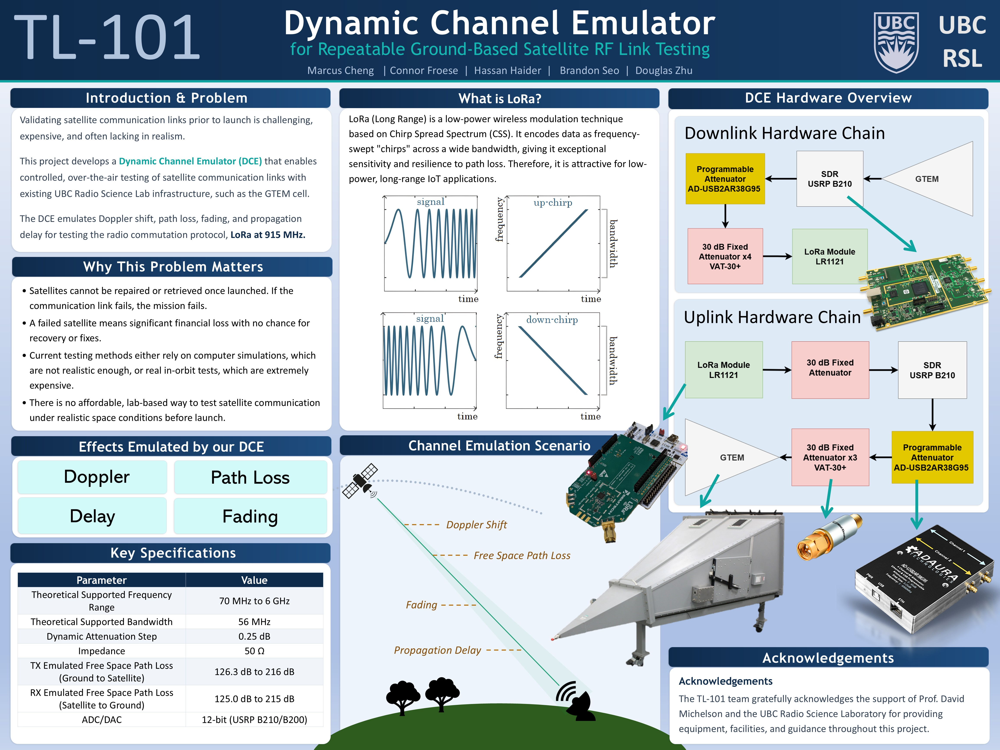
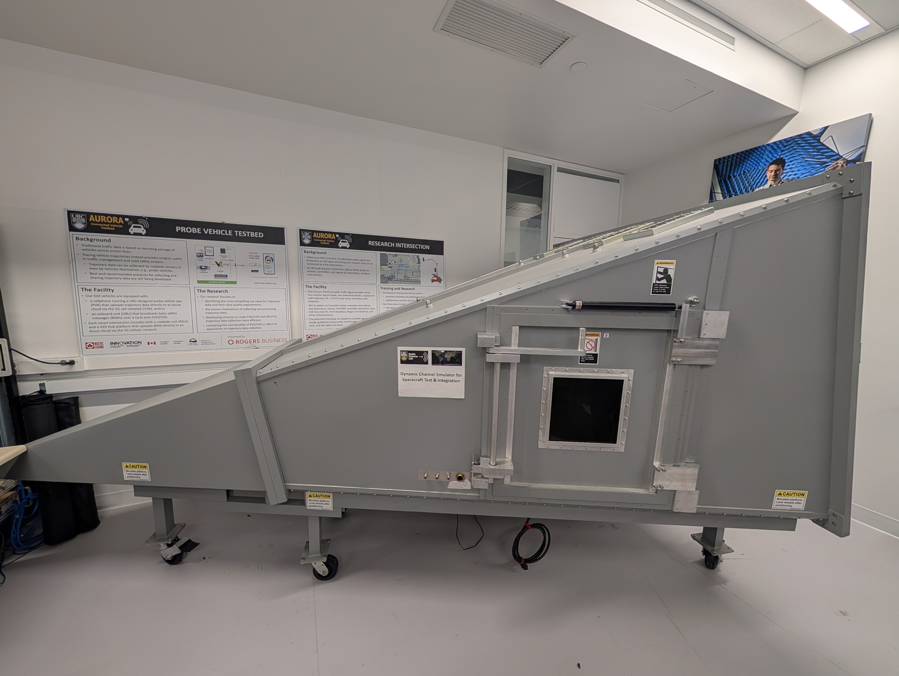
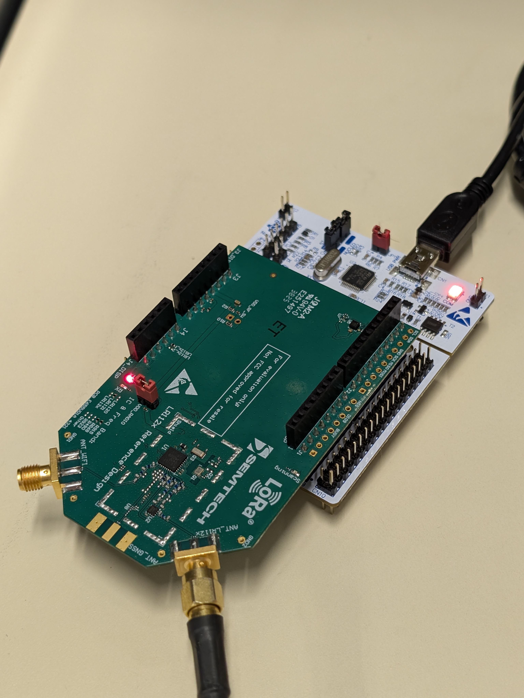
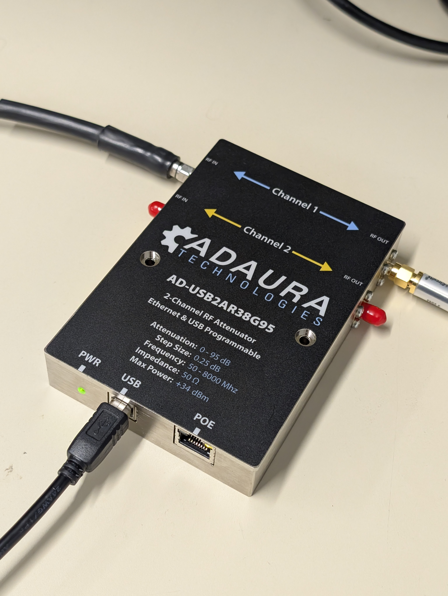
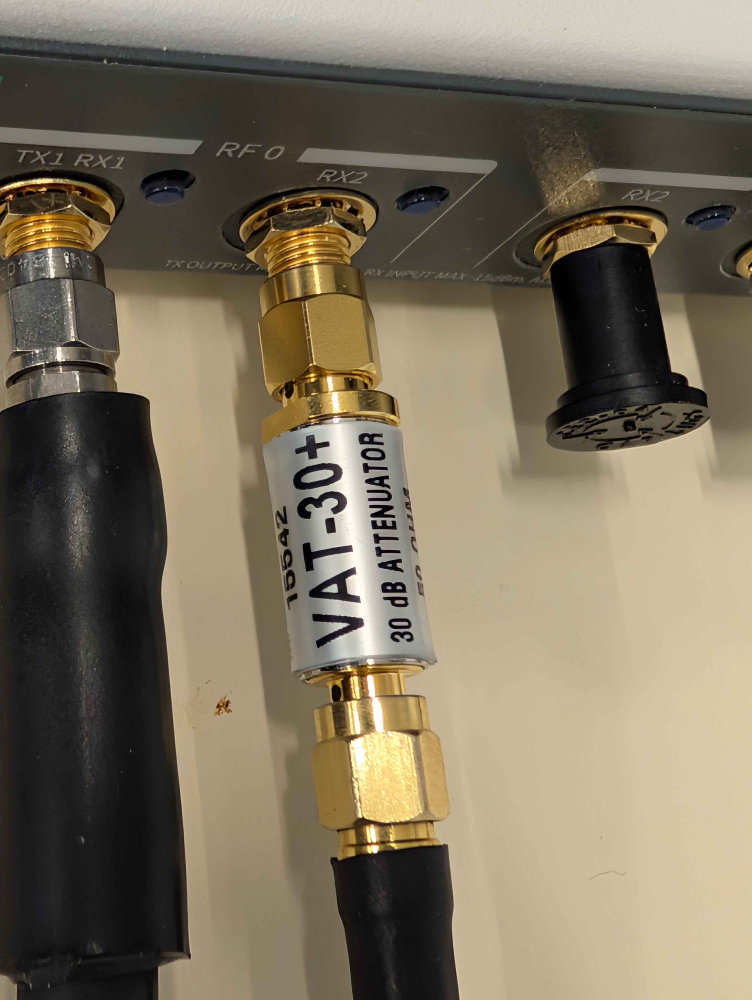
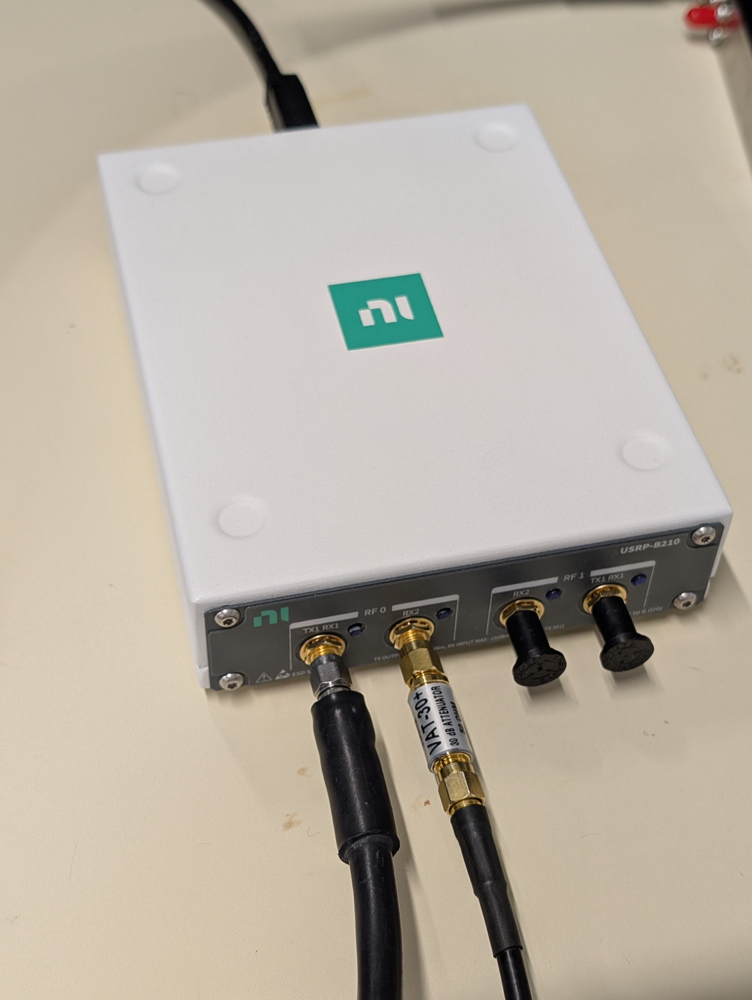

## Introduction

[Connor Froese](https://www.linkedin.com/in/connor-froese/), [Hassan Haider](https://www.linkedin.com/in/hassan-haider-zaidi/), [Brandon Seo](https://www.linkedin.com/in/seoobrandon/), [Douglas Zhu](https://www.linkedin.com/in/douglas-zhu-518a3a268/), and I designed, built, and tested a Dynamic Channel Emulator (DCE) for the [UBC Radio Science Laboratory (RSL)](https://radio.ece.ubc.ca/) as our ELEC 491 capstone project. Prof. David Michelson was our client and advisor.

In plain terms, the DCE is a ground-based testbed that emulates what a radio signal goes through on its way to and from a satellite in low Earth orbit (LEO): Doppler shift, free-space path loss, and propagation delay. This lets CubeSat developers test their radio links, over the air, before they ever ship hardware to a launch pad.

## Why this problem matters

A satellite can't be repaired or retrieved once it's in orbit. If the communication link fails, the mission fails. Which means a large financial loss with no second chance to diagnose or fix anything.

The problem is that there isn't a great way to check a link before launch. You can run a computer simulation, which often isn't realistic enough, or you can do an actual in-orbit test, which is extremely expensive. There is no affordable, repeatable, lab-based way to test a satellite link under realistic space conditions.

On top of that, low-power protocols like LoRa look promising for satellite IoT, but how they actually behave over an Earth–space link isn't well characterized yet. We wanted a way to find that out on the bench instead of in space.

## What the DCE emulates

The DCE reproduces four channel effects:

1. **Doppler shift** — the carrier frequency moves as the satellite races toward and away from the ground station.
2. **Free-space path loss** — the signal weakens with distance as the satellite passes overhead.
3. **Propagation delay** — the time it takes the signal to travel the link.
4. **Fading** — short-term fluctuations in signal strength.

Doppler, path loss, and delay run live in the hardware loop today. The fading model (Rician, K = 10, which is typical for a stable SatCom link) is written into the code but not yet validated inside the real-time loop, so for now it's scoped as future work rather than something I'd claim as working.

## How it works

The system runs in two phases.

**Phase 1 — Orbit simulation (MATLAB).** `OrbitSim.m` uses the [Satellite Communications Toolbox](https://www.mathworks.com/products/satellite-communications.html) to model the relative motion between a simulated CubeSat and a ground station. You give it the ground station coordinates, the carrier frequency, a rain rate, and a handful of orbital elements, such as altitude, eccentricity, inclination, and it produces three time-series profiles for a full satellite overpass: total path loss (dB), Doppler shift (Hz), and propagation delay (s).

**Phase 2 — Real-time emulation (hardware-in-the-loop).** `DCETest.m` takes those profiles and applies them to a live RF signal as the simulated overpass plays out. A USRP B210 SDR applies the Doppler shift (complex-exponential multiplication) and the delay (a circularly-shifted buffer), and a programmable attenuator (Adaura AD-USB2AR38G95) applies the path loss in 0.25 dB steps over a serial connection. A `tic`/`toc` timing loop keeps every effect applied at the correct simulated moment.

The whole thing runs over the air through the lab's GTEM cell, so the device under test (a real LoRa module, the Semtech LR1121) sees the emulated channel the same way it would see a real one. Mini-Circuits VAT-30+ fixed attenuators set the baseline operating point of each chain so the dynamic attenuator has room to work in.

The bigger-picture vision is multi-band: a 435 MHz TT&C chain, the 915 MHz LoRa chain, and a 1575.42 MHz GPS L1 chain, all combined through a triplexer into the GTEM cell with a CubeSat inside. For the capstone, we built and validated the 915 MHz LoRa link end to end.

## Key specifications

| Parameter | Value |
| --- | --- |
| Theoretical supported frequency range | 70 MHz – 6 GHz |
| Theoretical supported bandwidth | 56 MHz |
| Dynamic attenuation step | 0.25 dB |
| Impedance | 50 Ω |
| Emulated free-space path loss (ground → satellite) | 126.3 dB to 216 dB |
| Emulated free-space path loss (satellite → ground) | 125.0 dB to 215 dB |
| ADC/DAC | 12-bit (USRP B210/B200) |

## What I did

I was mostly responsible for these parts of the project: the hardware side of our **link budget models**, and the **DCE system diagram**.

For the DCE to be useful, the attenuation it produces has to match what a real satellite link actually experiences. So, the starting point is knowing those real-world numbers, which means building a link budget for the satellite link: transmit power, antenna gains, the free-space path loss across the overpass, and the receiver sensitivity, with a target of at least a 3 dB margin on every link. For our LEO scenario, that path loss sweeps from roughly 125 dB when the satellite is overhead to around 215 dB near the horizon, and that range is what the DCE has to reproduce.

My job was to set up the DCE hardware so its emulated attenuation lands on those numbers. The DCE has its own fixed losses sitting in the signal chain (cables, connectors, the VAT-30+ fixed attenuators, and the GTEM cell's coupling loss), and those have to be measured and accounted for, otherwise everything the DCE emulates would not be representative. I measured those baseline losses and folded them into the `fixed_att` value in the control code (150 dB in our setup). With that baseline subtracted out, the programmable attenuator's 0.25 dB steps land right on the path loss the orbit simulation asks for, so the device under test sees the same attenuation profile it would over a real overpass.

The second piece was the **DCE diagram** — the labeled system diagram that lays out the full signal flow and architecture of the emulator. It shows the TX and RX channel emulators for each band, the 435 MHz, 915 MHz, and 1575.42 MHz chains feeding a triplexer into the GTEM cell with the CubeSat inside, the GPS simulator, and the PC controller talking to everything over USB hubs. It's meant to work as both a quick overview for someone new to the setup and a detailed reference for whoever extends or troubleshoots it later.

## Pictures

*Our poster from the capstone showcase.*

*The GTEM cell at the UBC Radio Science Lab. The device under test goes inside this shielded enclosure, which gives us a clean, controlled environment to run the emulated channel over the air.*

*The Semtech LR1121 evaluation kit on its ST Nucleo carrier. This is our device under test.*

*The Adaura AD-USB2AR38G95 programmable attenuator, which does the dynamic part of the path loss emulation. MATLAB controls it over USB and steps the attenuation in 0.25 dB increments to follow the simulated overpass in real time. The two channels cover both link directions.*

*A Mini-Circuits VAT-30+ 30 dB fixed attenuator on one of the USRP's RF ports. We stack these to set the baseline fixed attenuation of each chain, which gives the programmable attenuator room to emulate the full path loss range while keeping the SDR's receive input safe.*

*The NI/Ettus USRP B210 software defined radio. This is what applies the Doppler shift and propagation delay to the live signal, anywhere from 70 MHz to 6 GHz.*