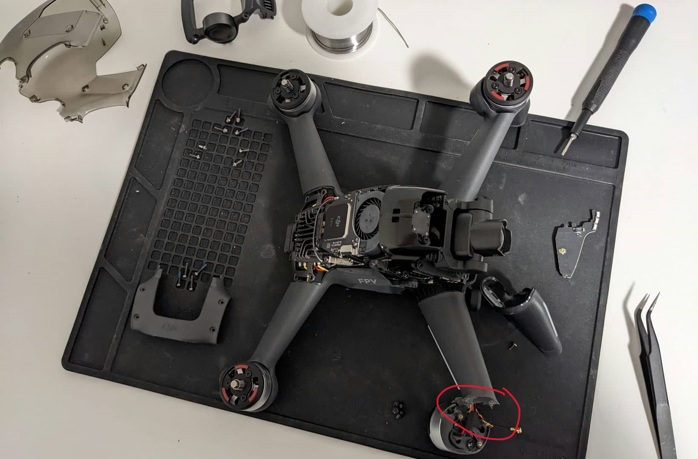
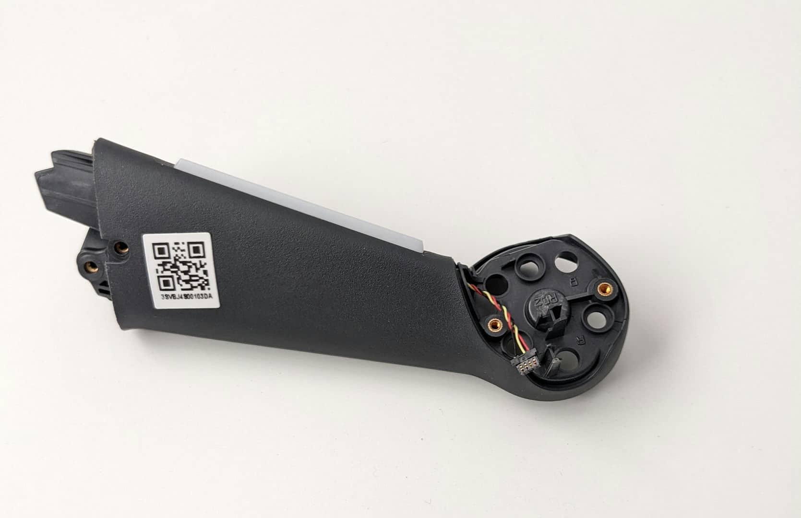
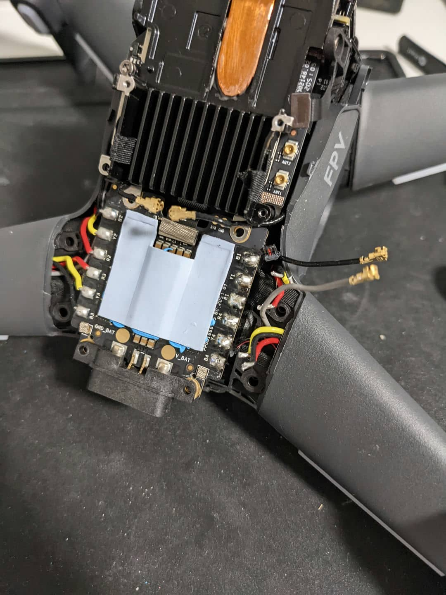
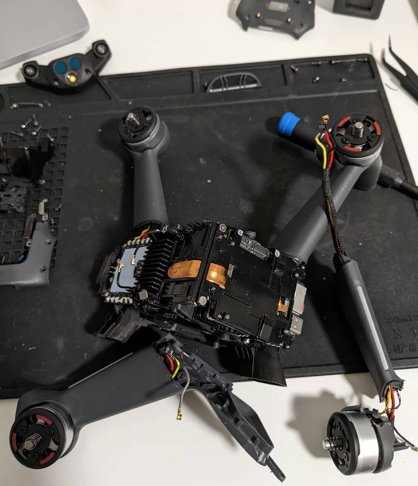
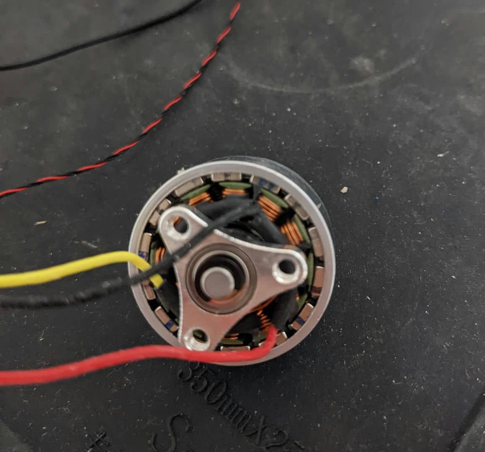
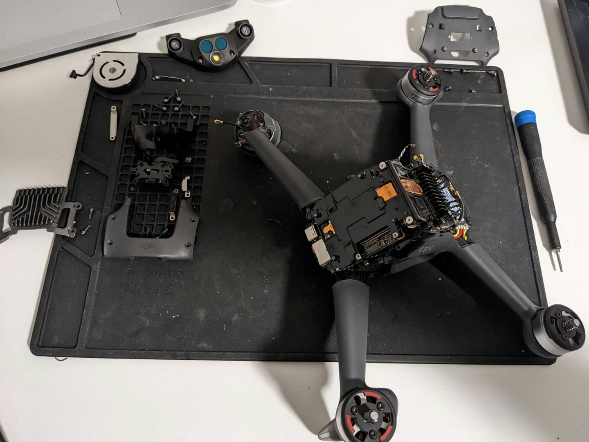
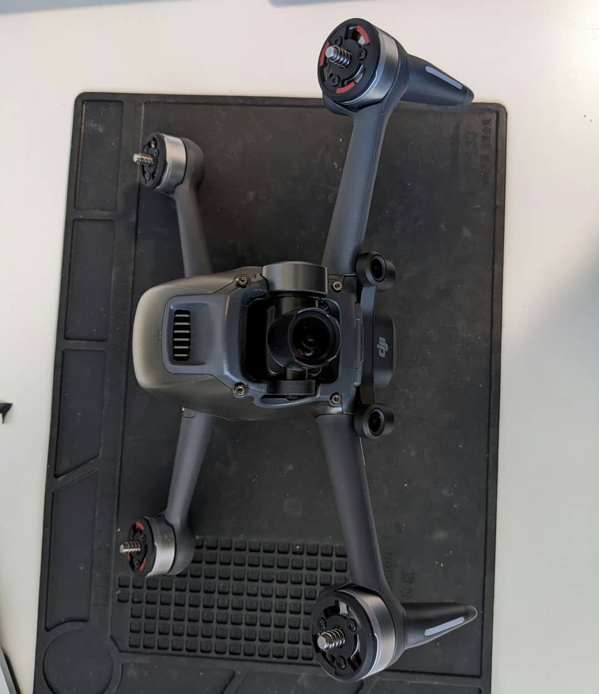

## What happened?
I was flying my DJI FPV drone the other day, and I crashed it. The right front arm broke off. I wasn't flying too high moments before the impact, maybe around 1.5 meters. So, I am guessing the (linear and angular) speed were the culprit. Well, not really. I am the culprit because I am the pilot who was controlling it. I better train more on the [simulator](https://www.liftoff-game.com) before the next flying session!

## The tutorial I used: 
<iframe width="750" height="420" src="https://www.youtube-nocookie.com/embed/5Fti49PDDbU" title="YouTube video player" frameborder="0" allow="accelerometer; autoplay; clipboard-write; encrypted-media; gyroscope; picture-in-picture" allowfullscreen></iframe>

## Snippets of the repair process:
The broken section is circled in red. \

This is the new arm that I am replacing the broken one:\

Desoldered the wires of the right front and rear arms. (I need to remove the rear arm to make the repair process easier)\

The right arms are out!\

Motor! Look at how close the rotor and stator are! (The outer, stationary part is the stator; the inner, rotating part is the rotor)\

Assembling the drone:\

I am finally done! This took me at least 8 hours to complete.\

