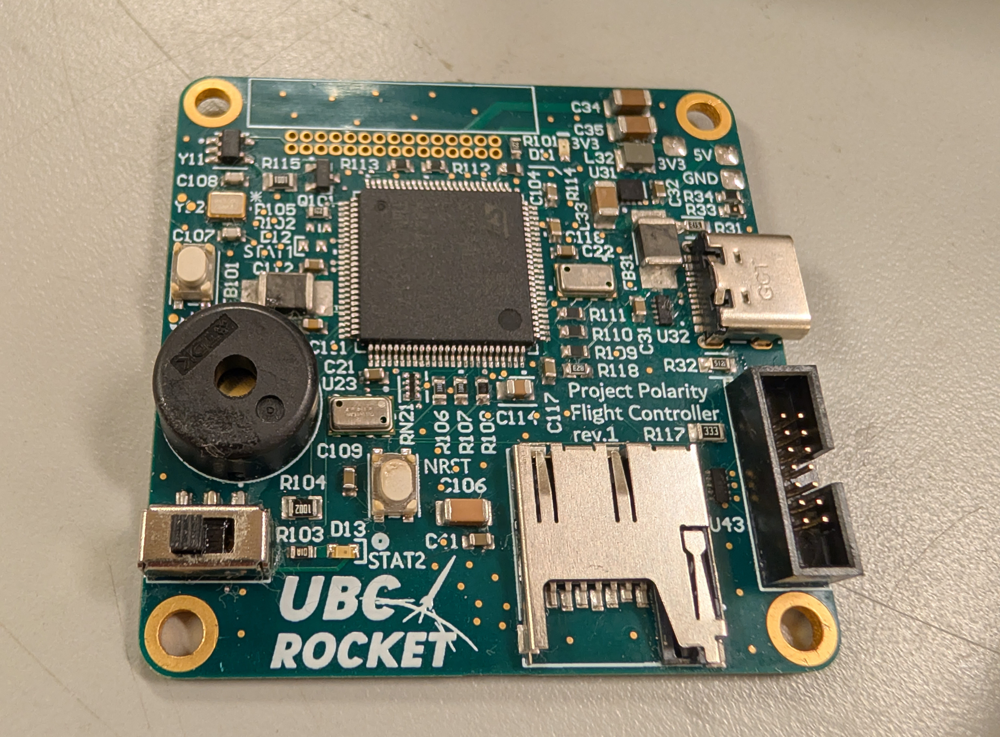
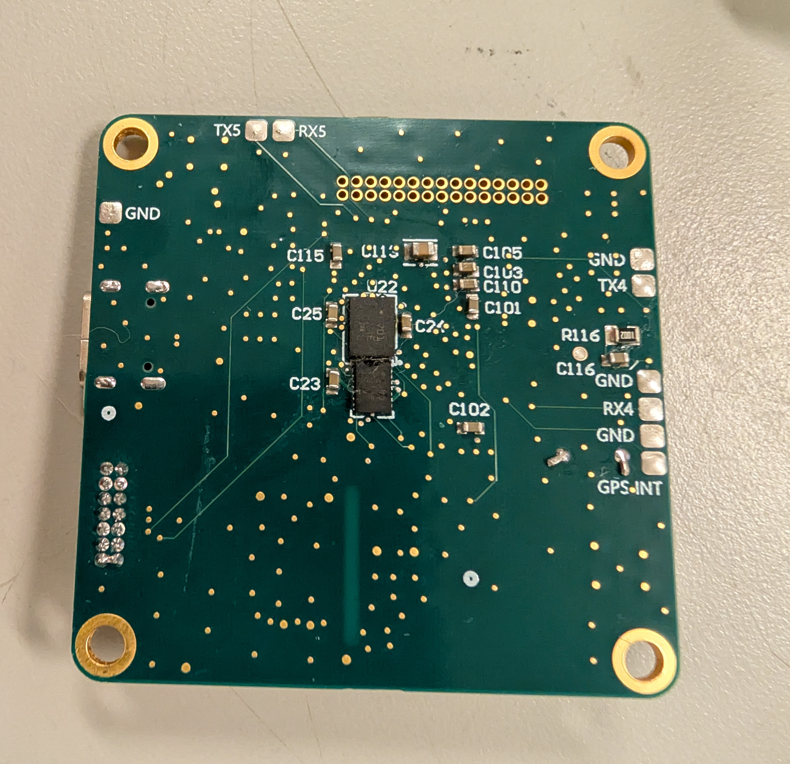

## Introduction

I designed, assembled, and validated the new flight controller PCB for UBC Rocket. Built around an STM32U575VGT6Q MCU, it is the brain of the rocket: it tracks how high the rocket is and how it is moving, logs everything to an SD card, and communicate to the rest of the avionics stack over a 30-pin ribbon connector. This version is an 8-layer board populated on both sides. It is 30% smaller than the previous flight controller and carries twice as many sensors, adding redundancy while decreasing the size.

Since my [first PCB](/projects/radio-pcb), a two-layer board I made in Eagle, my UBC Rocket boards have gotten steadily more complex. This is my first 8-layer, gold-plated PCB, and by a good margin the most involved board I have designed. Getting from a handful of layers to eight, populated on both sides, in a smaller footprint, was the real challenge of the project.

## Features:

### Sensors:

- Two barometers, an MS561101BA03-50 (±10 cm) and an MS560702BA03-50 (±20 cm), give altitude from air pressure. Running two lets one back up and cross-check the other, and apogee detection.
- The BMI088 IMU is rated to ±32 g, so it can measure the initial intentse acceleration of motor burn instead of clipping at the top of its range.
- The BNO085 IMU is rated to ±8 g and runs on-chip sensor fusion, so it outputs orientation directly without the MCU doing the fusion math.
- The two IMUs are picked so they do not overlap: the BMI088 covers the high-g boost phase, the BNO085 covers attitude. So, the doubled sensor count buys redundancy and widens what the board can measure, not just duplicates it.

### Power:
- A USB-C connector deliver power to the board when the 30-pin ribbon connector is not connected, and an AP3441 buck converter steps it down to the 3.3 V rail that runs the STM32 and the sensors.
- A PUSB3FA2Z TVS diode package sits on the USB data lines for ESD protection.

### Storage:

- A microSD card slot logs flight data over SPI, so the barometer and IMU streams can be reviewed after the flight.

## Pictures

*Front of the Flight Controller*

*Back of the board. Populating both sides is part of how it ended up 30% smaller.*