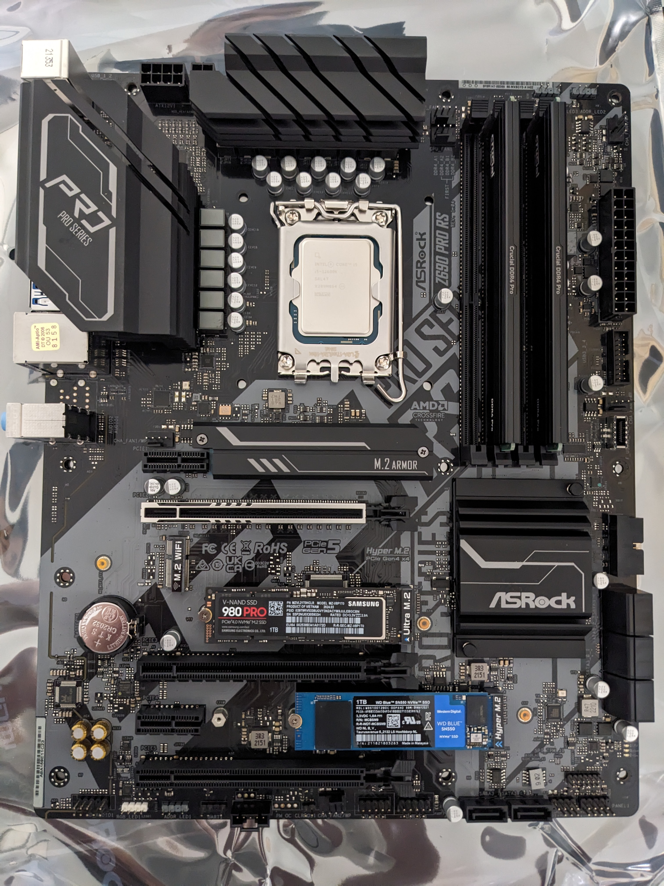
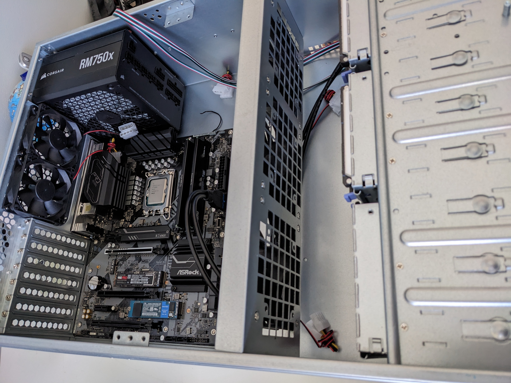
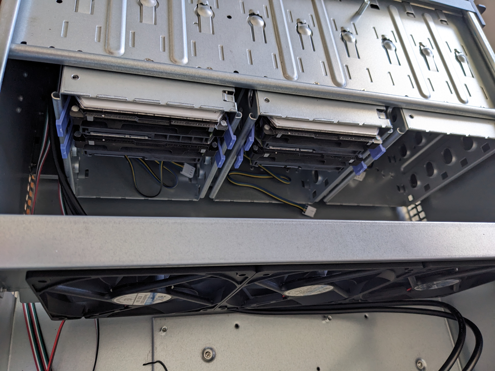
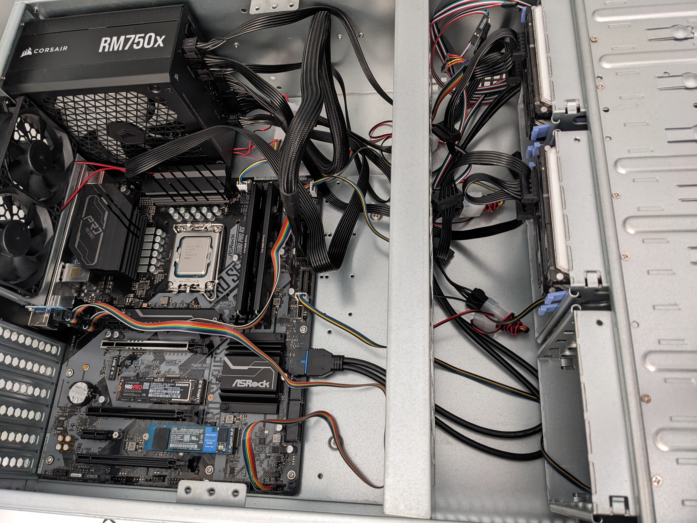
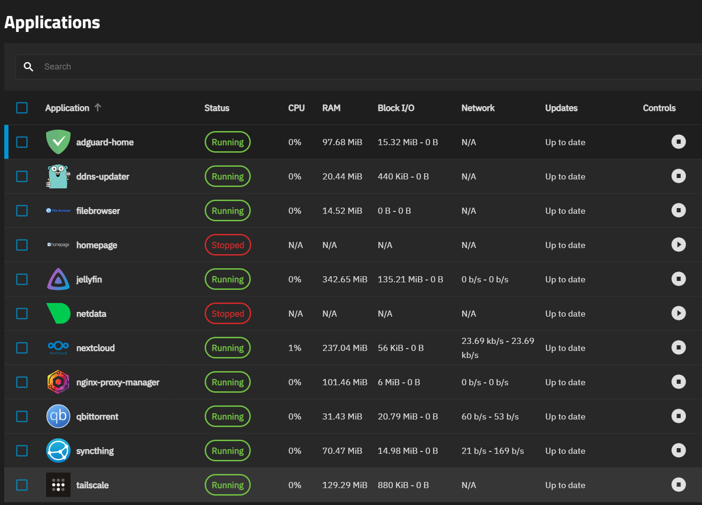

## Introduction

I have been wanting to build something like this for a long time, long enough that I don't even remember when I started to want to build something like this. I want to build a home server/lab because I want to learn more about computer networking, linux, and try tools/software like docker, TrueNAS, nextcloud, jellyfin, and nginx proxy manager. As you read along, please be gentle if you want to judge me since this is my first time at homelabbing. 

## Hardware

There are two options for picking the hardware of the server, I can either buy a pre-built/turnkey solution, or build my own. I decide to go with the second option because I like to customize the parts that go into my server and assembly it myself, and it is cheaper compare to turnkey solutions that has similar specs. Speaking of specs, below are the parts that I used to build my server:

- CPU: Intel Core i5-12600k
    

    
Why?

    Because it meets all of my requirements, and they are the following: 
    <li>CPU with Intel Quick Sync for transcoding media 
    <li>Low idle power draw, I think this <a href="https://mattgadient.com/7-watts-idle-on-intel-12th-13th-gen-the-foundation-for-building-a-low-power-server-nas/">article</a> is a good summary why Intel platform has lower idle power draw compare to AMD (at the time of purchase: Q3 2024)
    <li>As much threads and cores as possible while being reasobaly priced. The 12600k is the cheapest one with 16 threads and has the best intel igpu on desktop at the time</li>
    

- CPU cooler: Deepcool AG400
    

    
Why?

    Not much I can say, it is the cheapest decent CPU cooler available to me at the time that support LGA1700. 
    

- RAM: 2x32GB Crucial Pro DDR4 3200MT/s
    

    
Why?

    I went with DDR4 because the services that I will be running on my server doesn't benefits much from the faster, but more expensive DDR5, and my 12600k doesn't support DDR3. I went with 64GB because it is a good balance between cost and capacity, which ZFS loves.
    

- Motherboard: ASRock Z690 Pro RS
    

    
Why?

    Cheapest one that support DDR4, LGA1700, enough SATA ports (I know I can add more with a HBA, but I that is another rabbit that I would need to dive into before needing to pick one, so I didn't bother). Also, I heard some people on the internet who has this board has no major problme with it, including getting the system to C10! Unfortunately, I couldn't find the link to that when I am writing this. But you can trust me because I can get the system to regularly idle at C10. Which I have a picture below for that. 
    

- HDD for ZFS pool: 4xWD Red Pro 8TB
    

    
Why?

    Not much I can say, but I got them used at a very good price, and I made sure they are not SMR drive. If you don't know what are SMR drive are, they generally have much slow write speed compare to CMR drives, which would be apparent during write intensive scenario such as reslivering. <a href="https://arstechnica.com/gadgets/2020/06/western-digitals-smr-disks-arent-great-but-theyre-not-garbage">This</a> is a pretty good article compare SMR drives with CMR drives. 
    

- SSD for OS: Samsung 980 Pro 1TB & WD SN570 1TB
    

    
Why?

    I know that 2x1TB SSD is quite wasteful for a mirrorred boot drive setup for TrueNAS. But all I can say is I am going to repurpose them as cache after I get a pair of lower capacity SSDs. I already have the SN570 lying around, and I bought the 980 pro because it was on a good discount and it is a decent drive. Yes, I did make sure the firmware on the 980 pro is the latest to prevent the rapidly degrading issue. 
    

- PSU: Corsair RM750x 
    

    
Why?

    There is this awesome <a href="https://docs.google.com/spreadsheets/d/1TnPx1h-nUKgq3MFzwl-OOIsuX_JSIurIq3JkFZVMUas/edit?gid=110239702#gid=110239702">spreadsheet</a> by the Wolfgang's Channel that contains the efficiency of a ton of PSUs under ultra lower power draw. I recommend you to also check out the <a href="https://www.youtube.com/watch?v=TPSuCbS-4P0">complementary Youtube video</a> on his channel as well. 

    I was trying to find a PSU that is near the top of the chart, but they are either too expensive or not available anymore. However, when I was showering, I thought that I already have a PSU that is near the top of chart in my current desktop, and I can just use that one and get another one for my desktop. Since my desktop won't be always on, and won't draw that little power when it is on anyway (keep in mind that spreadsheet only applies to low power draw), this is a good option!
    

- Case: Rosewill RSV L4500U
    

    
Why?

    I have a few requirements for the case, and they are the following: 
    <li>Rack mountable so that I can put this on a rack with other equitment I have planned/want in the future
    <li>4U so that it can fit a full size ATX PSU, 120mm fans, and a normal height CPU cooler.
    <li>Enough mounting point for fans or includes enough fans for adequate air flow. 
    <li>At least ~8 HDD bays for future expendability</li>
    I picked this case because it meets all my criteria, but I will have to admit it is a bit expensive.
    

The building process is very similar to a regular desktop PC. Below is some pictures I took when I was building it:

I first installed as much as I can on the the motherboard:

Then, I installed the PSU into the case, and put the motherboard in:

Next, I installed the HDDs into the case:

Finally, I connect all the things:

Yes, I don't have a picture with the CPU cooler on it. But trust me, it is installed. With hardware out of the way, lets move on to the software!

## Software

My initial plan was to install Proxmox VE and install TrueNAS and other apps with docker and/or LXC containers on Proxmox. However, the more I research about having TrueNAS on Proxmox, the more I hesitate. That is because this setup would let TrueNAS not able to monitor all the metrics of the HDDs, thus leading to potental data loss. I know there are probably packages I can install on Proxmox to monitor the health of the HDDs, but the GUI of TrueNAS makes this much easier. 

Furthermore, iXsystem just released TrueNAS Scale Electric eel recently back when I was setting this up. This version changed the "Apps" backend from Kubernetes to Docker, allows ZFS VDEVs expansion, and many more. But those two features alone are very attractive to me because it would make things easier for me as a beginner because I can just use the GUI instead of CLI of proxmox. 

So, I installed TrueNAS on my first ever server. The process of setting up TrueNAS including installing the OS and adding a pool is pretty easy because there are plenty of tutorial online. However, the harder part was installing apps because all the old tutorial are outdated since the new backend is using docker. The hardest one was Nextcloud, which took me a few days of trial and error to get a functioning instance. Anyway, I am running the following apps: 

I was planning to explain why I installed each application, but the reasons are pretty much just for fun, learn, and want to control the services that I use (maybe suffering as well). If I have more time, I would definitely spend more time on the server and tinker with it more. But as school start, I need to wrap it up for now. I don't think I mentioned I was do this during the Christmas break between term 1 and 2, and I had basically a week to set all this up. 

## Wrap up
There was more pain than I expected when I was setting my server up, but that is fine because I like to build up my pain tolerance for the future. If I am to upgrade this setup, I would build/get another server and install proxmox on it. This would seperate the mission critical storage server from my tinker playground. 

Anyway, if you want to contact me regarding this projects, feel free to contact me via [email](mailto:hello@marcusc.me) or [LinkedIn](https://linkedin.com/in/techno-marcus).
