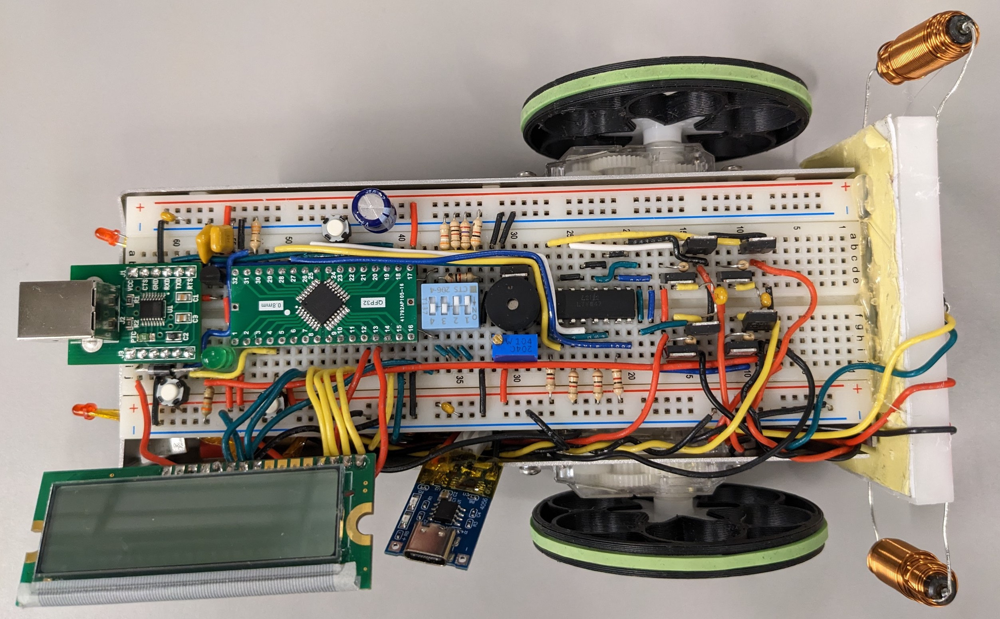
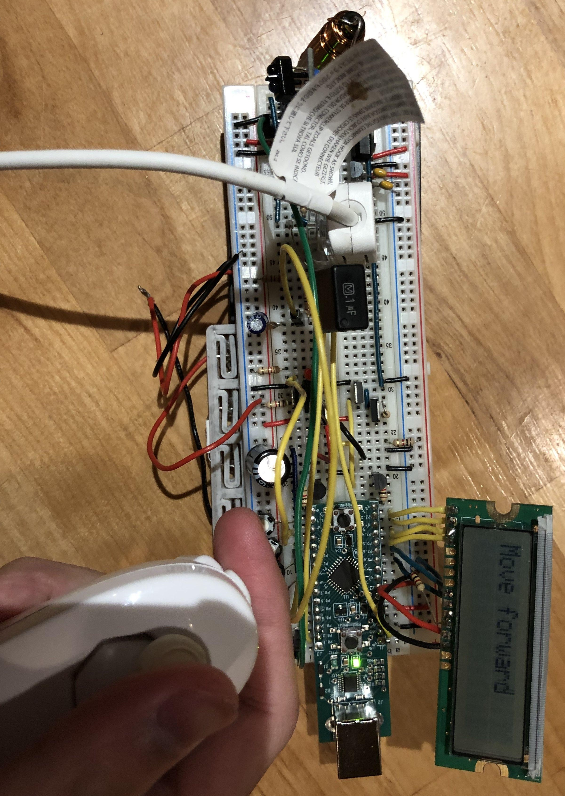

## Introduction
Our team designed and built a remote controlled autonomous robot controlled via varying magnetic field. The varying magnetic field source is from a remote that we also built. The code and all the parts we used can be found via this [link to GitHub](https://github.com/Beluguy/Elec-291/tree/main/Magnetic-Field-Controlled-Robot).

## Top view the robot:

## Top view of the remote: 

## Our Video presentation
<iframe width="560" height="315" src="https://www.youtube-nocookie.com/embed/x-TR2Ii_tiQ" title="YouTube video player" frameborder="0" allow="accelerometer; autoplay; clipboard-write; encrypted-media; gyroscope; picture-in-picture; web-share" allowfullscreen></iframe>

## What I did
I was primarily responsible for the hardware of the robot. Therefore, I will talk mostly about the hardware.  

The hardware of the robot consists of two main parts, the receiver, and the microcontroller system. For the microcontroller system, we used the STM32L051 from STMicroelectronics. We picked this microcontroller out of the six available ones because when compared to the available ones, it has excellent documentation, it is fast, it has a lot of timers and generous amount of memory. Overall, we think the STM32L051 is an all-rounder and should be able to handle the all the tasks an additional feature we throw at it. 

Since the STM32L051 uses 3.3V for its power input, we need to use an additional 3.3V voltage regulator in addition to the 5V regulator which the rest of the system need. This means the voltage regulator would take up extra spaces and potentially generate more mess, so this is one of the downsides compare to other microcontrollers which uses 5V instead. However, we thought that this trade-off is worth it because of the superior specifications.

For the receiver of the robot, it would receive the signals from the transmitter with inductors, amplify the voltage and transform it to a signal we can read easily. We constructed a non-inverting voltage amplifier with an operational amplifier, selected resistors values of 47kOhm for Rf and 1kOhm for R2 to achieve a gain of approximately 50. 

The amplified signal then need to be converted to a signal from which we can read lows and highs easily. We achieved this with an RC peak detector circuit that consisted of a diode in series with a resistor and capacitor in parallel. We calculated the values of the capacitor and resistor to be 0.1uF and 470kOhm such that “ripple voltage is not big enough to flip the least significant bit of the microcontroller ADC between consecutive readings,” as mentioned by our professor while balancing an input frequency of 16.275 kHz from the transmitter. This signal was then sent to the ADC of the STM32L051 microcontroller system to process.