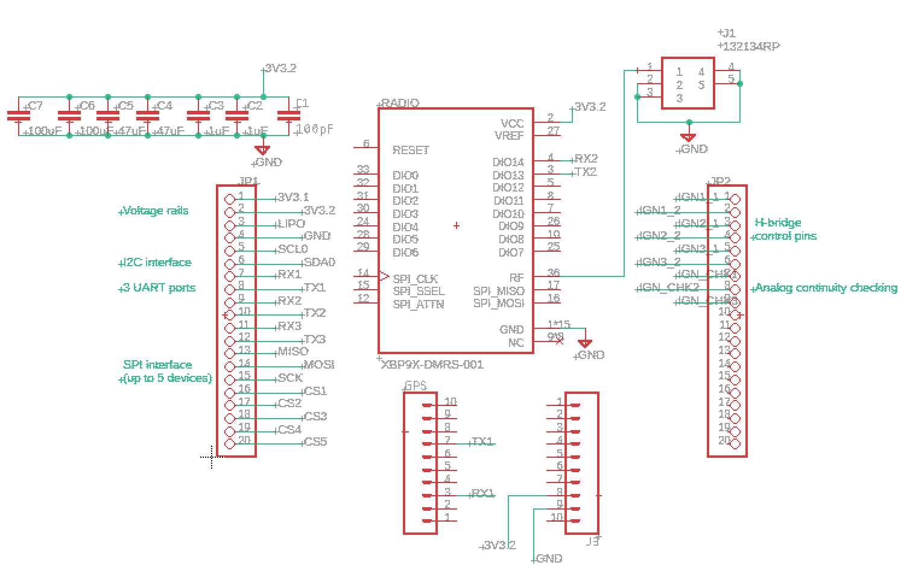
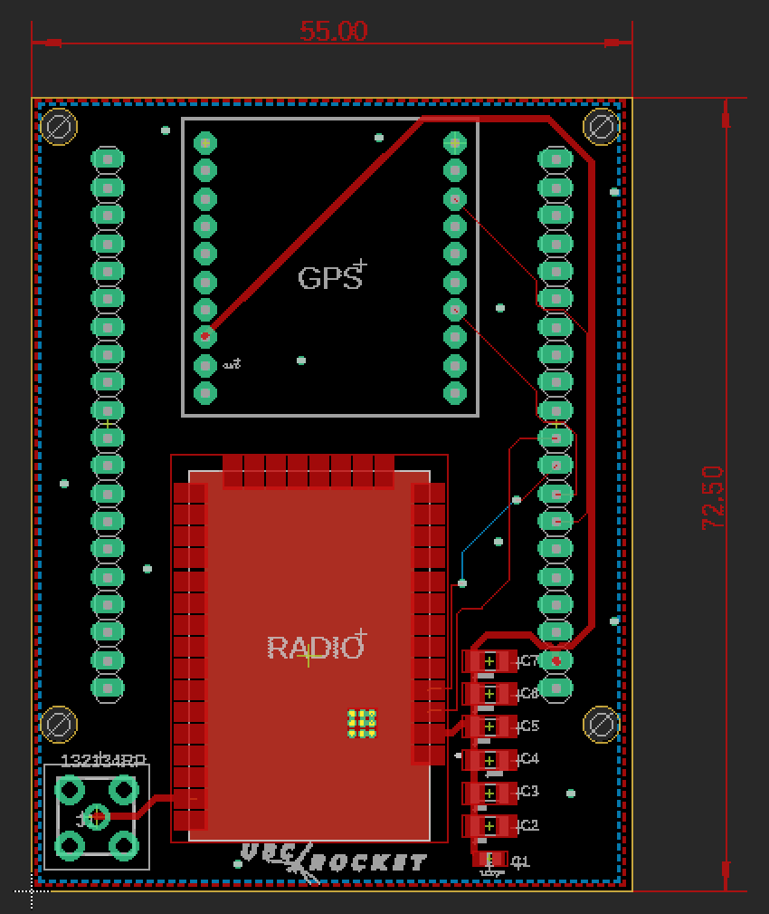
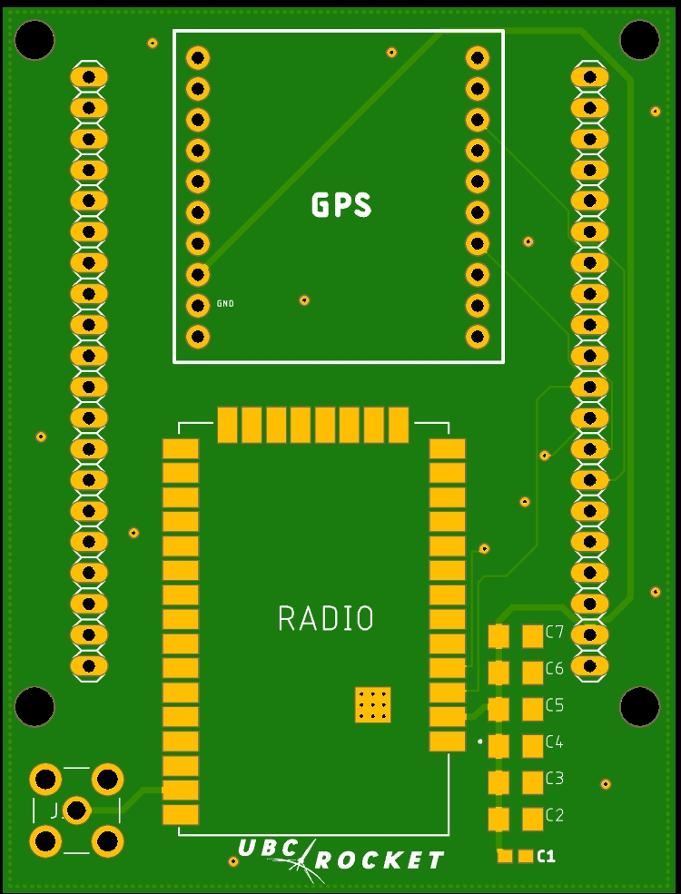
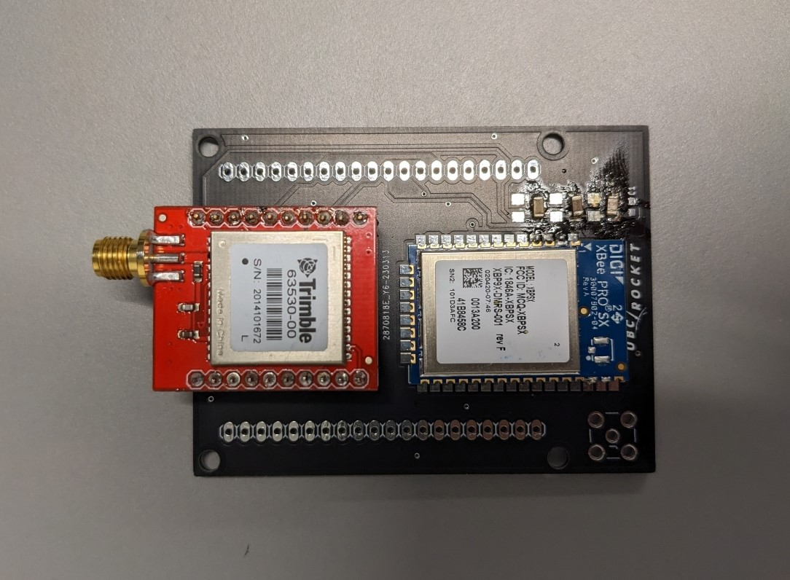
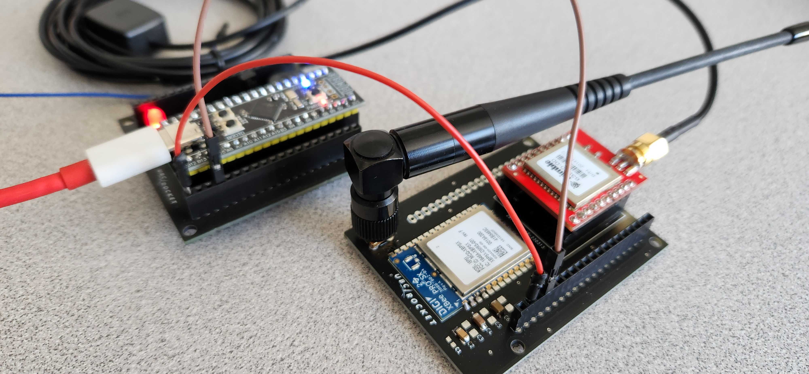

## Introduction
My teammate, [Daniel](https://danielzn.com/) and I designed and validated the radio communication PCB for North American’s first successful student-made 2-stage rocket, which [won first place](https://www.instagram.com/reel/Cw6-koEogTa/) in the advanced category at the Launch Canada 2023 Rocketry Competition.

We made this design using Autodesk Eagle. This was my first time designing a PCB, so the design is quite simple with only two layers. I will switch to using Altium Designer for future PCBs project because I see many employers prefer that instead of Autodesk Eagle. 

## Pictures

### Schematic 

### Layout

### Testing Setup

