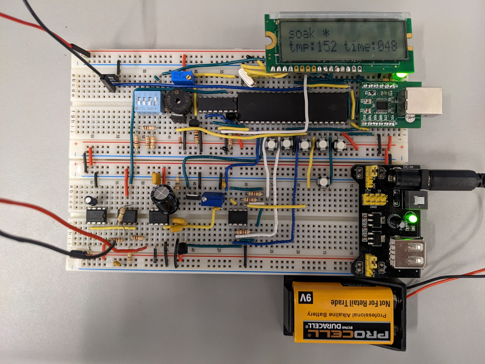

## Indroduction
My teammates and I designed and built a reflow oven controller that controls the temperature of an oven via a pulse width modulation (PWM)  signal to an solid-state relay (SSR) box. The reflow parameters such as reflow temperature, reflow time and cool down temperature can be adjust. The parts we used can be found via this [link to github](https://github.com/Beluguy/Elec-291/blob/main/reflow-oven-controller).

## Top view of reflow oven controller

## Test board
To verify that our controller is working, we made a board using our controller. It is perfect!👌We then hand solder the header pins and the USB port to it after.

## Our video presentation
<iframe width="560" height="315" src="https://www.youtube-nocookie.com/embed/PtcOZ4iowKk" title="YouTube video player" frameborder="0" allow="accelerometer; autoplay; clipboard-write; encrypted-media; gyroscope; picture-in-picture; web-share" allowfullscreen></iframe>

## What I did

I was primarily responsible for designing the finite state machine (FSM) for the reflow process. Therefore, I will talk mostly about the FSM. 

As seen below, the reflow process consist of 5 phases per cycle. Each cycle last a different amount of time and required to be in a different temperature range. To control the temperature of the oven, we can to adjust the amount of power used by it. Since the toaster oven available to us can only operate at full power when it is on, we need to use some "trick". 

One way is to use PWM to control the toaster oven power level. The output of our microcontroller system is turned on and off at specific intervals of time to allow the temperature of the oven to be relatively stable during soaking and reflow state. The ratio of on and off time is determined by manual calibration at each phase to match the reflow cycle for the most sensitive componets on our test board.
