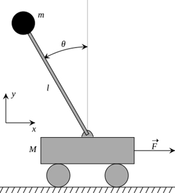
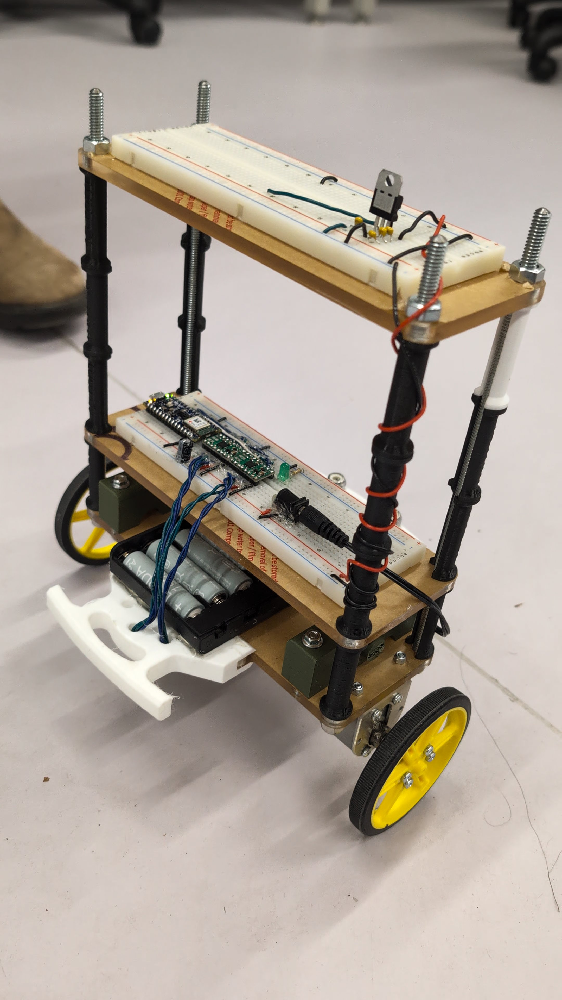
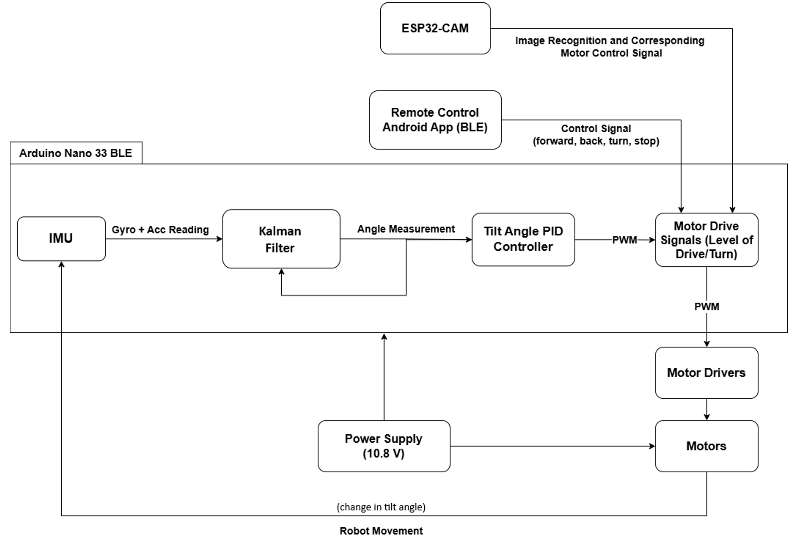
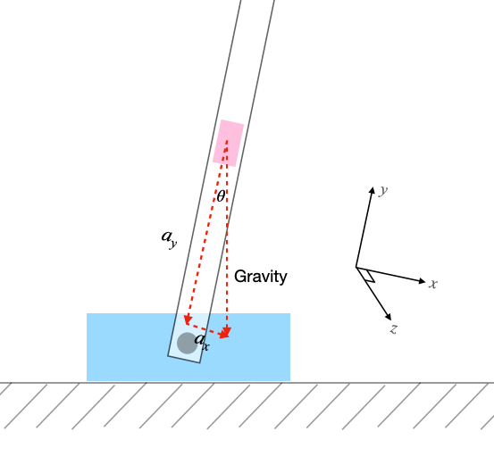
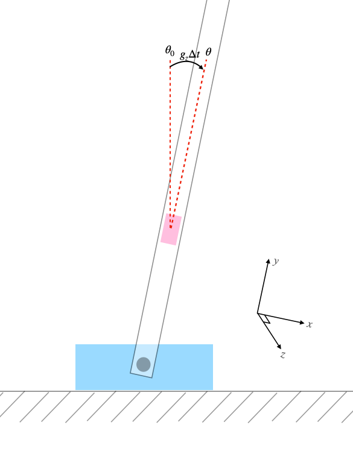
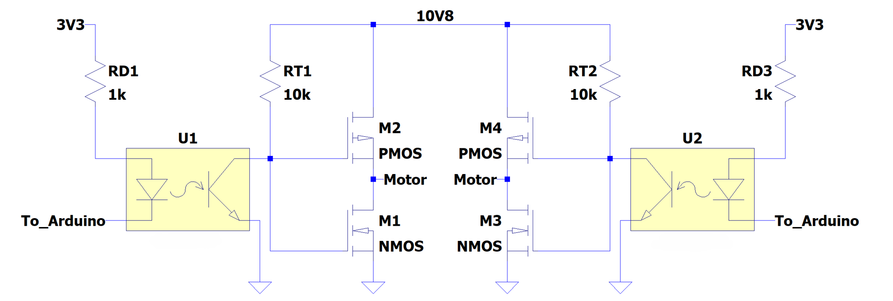
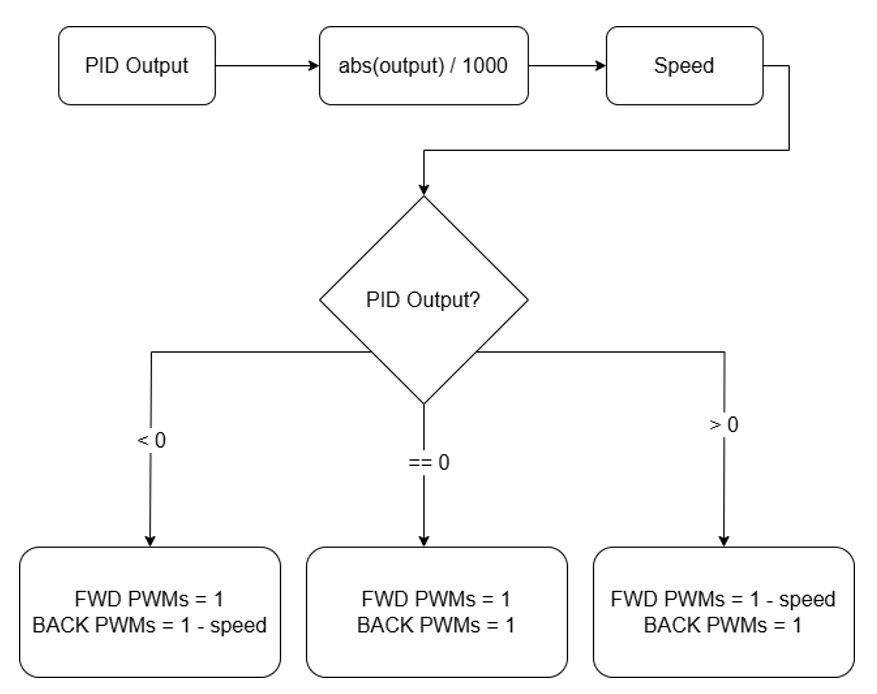

## Introduction

[Youssef](https://linkedin.com/in/youssef-chaabani), [Ryangwon](https://www.linkedin.com/in/ryangwonkim/), and I designed, built and tested a two wheel, Bluetooth controlled self-balancing robot. Our robot can move forward, backward, turn left, turn right, and come to a stop based on received Bluetooth commands, while maintaining balance. 

Additionally, a computer vision system was implemented on top of this robot. The purpose of this computer vision system is to simulate the idea of autonomous vehicles, recognizing various signs, gestures, or other real-world factors that affect vehicle movement. However, I did not work on the this. All the credits for the computer vision system goes to [Youssef](https://linkedin.com/in/youssef-chaabani).

The code for this project can be found via this [link to GitHub](https://github.com/Beluguy/ELEC391/tree/main/Self-balancing-robot).


## Motivation/background context
This project was very compelling to us because self-balancing robots represent a cornerstone of modern control systems engineering, combining principles of robotics, embedded systems, and real-time feedback control. These systems are inherently unstable, requiring continuous adjustments to maintain equilibrium—an analogous to balancing an inverted pendulum, as seen in Figure 1. The problem has broad applications in the real world, such as thrust vectoring system in rockets and other aerospace vehicles for controlling flight trajectory. 

<p align="center">
    
    <figcaption>Figure 1 - Inverted Pendulum Model [1]</figcaption>
</p>

## Pictures & videos
Below is a picture of our robot balancing, and [here](https://drive.google.com/drive/folders/1zVAygbbTHAXGJ0K1NEUSu0PNLeRRB2FD?usp=sharing) is the link to a video showing the features of our robot, which are: 
1. Balancing stationary
1. Forward 
1. Backward
1. Turn left
1. Turn right
1. Recover from a tilt angle of ~30°
1. Computer vision system



## High-level overview
First, raw gyroscope and accelerometer readings are taken from the built-in BMI 270 IMU on the Arduino. Next, the calibration constants are subtracted from the raw readings to get more accurate readings. Then, a Kalman filter is used to combine the subtracted readings from the gyroscope and accelerometer to get a less noisy and more reliable tilt angle of the robot. 

After that, the tilt angle is fed into a PID controller, which outputs the appropriate PWM signals to a pair of motor drivers. The pair of motor drivers then each drive a DC motor based on the input PWM. Subsequently, the pair of DC motors correct the angle of the robot to the desired angle by moving in the direction of tilting. 

To move forward or backward, the desired angle of the robot is set to +0.6 and -0.6 degrees. To turn left or right, the appropriate wheel is set to be stationary while the other wheel is fed the normal amount of PWM. 
Furthermore, the ESP32-CAM and BLE Remote Control App can be used to control the robot’s driving modes. Eight 1.2V AA batteries were used to power the whole system. 


<figcaption>Figure 2 - High-Level Functional Diagram of the robot</figcaption>


## Detailed explanation of what I did
I primarily worked on getting the robot to balance, which contains the following subtask/subsystem:
1. [IMU Library Modification & Calibration](#imu-library-modification--calibration) 
1. [IMU Angle Calculation](#imu-angle-calculation)
1. [Angle Measurement Filter](#angle-measurement-filter)
1. [PID Controller](#pid-controller)
1. [Motor Driver](#motor-driver)
1. [Motor Drive Signal and Movement Control](#motor-drive-signal-and-movement-control)


### IMU Library Modification & Calibration

Before the tilt angle from the accelerometer and gyroscope were obtained, modifications to the sensor configurations and calibration of the raw IMU readings were crucial to ensure accurate measurements.

By default, the sampling rate of both sensors is approximately 100 Hz. To improve the robot’s responsiveness to disturbances, we increased the sampling rate by modifying the IMU library. For Windows systems, navigate to:

```
C:\Users\<Username>\Documents\Arduino\libraries\Arduino_BMI270_BMM150
```

and open the `.cpp` file called `BMI270.cpp` inside the `src` folder. Then, modify the function called (should begin on line 210):

```cpp
int8_t BoschSensorClass::configure_sensor(struct bmi2_dev *dev)
```

by making the following changes:

| Original code              | Modified/added code                     |
|----------------------------|-----------------------------------------|
| `BMI2_ACC_ODR_100HZ`       | `BMI2_ACC_ODR_1600HZ`                  |
| `BMI2_ACC_RANGE_4G`        | `BMI2_ACC_RANGE_2G`                    |
| `BMI2_GYR_ODR_100HZ`       | `BMI2_GYR_ODR_1600HZ`                  |
| None                       | `sens_cfg[1].cfg.gyr.noise_perf = BMI2_PERF_OPT_MODE;` |

Besides increasing the sampling rate from 100 Hz to 1600 Hz for a faster response, we also enhanced the accelerometer’s resolution by decreasing its range, and reduced the gyroscope's noise by activating its dedicated noise optimization feature.

For the calibration process, the robot is placed stationary on a vertical stand, aligning the IMU’s vertical axis with the direction of gravity. The sensor readings are then summed over a period of time and averaged to detect any offset.

--- 

### IMU Angle Calculation

After obtaining the calibration offset and modifying the IMU library, we can subtract them from any subsequent readings to get a more accurate reading. Now, we can calculate the tilt angle from the accelerometer and gyroscope.  Each sensor has its own strengths and limitations. However, when combined, they yield a more stable and precise measurement than when used independently. 

For the accelerometer, since it will always detect gravitational acceleration in the vertical direction, the tilt angle in degrees can be derived using the inverse tangent of the acceleration of the horizontal axis of tilt and acceleration of the vertical axis of the IMU as shown below. 

 $$ \theta = \arctan \left( \frac{a_y}{a_x} \right) \tag{1} $$


<figcaption>Figure 3 - Accelerometer Angle [2]</figcaption>

Since gravity consistently points in the vertical direction, the reading error will have a zero mean. Thus, the accelerometer does not accumulate measurement bias (unlike gyroscopes) meaning that the measured acceleration along the vertical axis (y-axis) represents the true gravitational acceleration with some zero-mean Gaussian noise. However, the variance of the Gaussian noise can be significant depending on the specific accelerometer used. For our accelerometer, the noise is significant enough that we can’t just rely on it to get the tilt angle. 

For the gyroscope, it measures the angular speed of tilt in degrees/seconds. To find the tilt angle, we need to integrate the readings and add an integration constant \\(\theta_0\\). To perform integration on a discretized system, we need to know the sampling rate (∆t) and multiply that with the angular speed reading. Therefore, the tilt angle can be computed using a gyroscope with the formula below.

 $$ \theta = \theta_0 + g_z \cdot \Delta t \tag{2} $$


<figcaption>Figure 4 - Gyroscope Angle [2]</figcaption>

As a result of the continuous integration, the gyroscope measurement accumulates bias in time, causing it to be unreliable over extended periods of time. 

After calibrating the raw readings and calculating the tilt angle from both sensors independently, we combined their readings by using an angle measurement filter to leverage the advantages of each sensor, resulting in a more precise and less noisy measurement. 


---

### Angle Measurement Filter
As discussed in the previous section regarding the IMU calibration and angle calculation, relying solely on just the accelerometer or just gyroscope does not yield an accurate tilt angle estimate. To address this challenge, we tried to use both complementary filter and Kalman filter. Ultimately, the Kalman Filter was selected for its superior accuracy and noise reduction capabilities, making it the preferred choice in the final design.

#### Complementary Filter
In the initial design, the complementary filter was used. This technique combines the strengths of both the accelerometer and gyroscope readings by applying a high-pass filter to the gyroscope readings, and a low-pass filter is applied to the accelerometer readings. The high-pass filter works by attenuating low-frequency drift while retaining high-frequency angular changes. The low pass filter works by attenuating high-frequency noise, preserving reliable low-frequency (steady-state) angle estimates. 

To implement this filter in a discretized system, we used a filter coefficient, \\(k\\) that decide which sensor to trust more. A higher \\(k\\) trusts the gyroscope for quick moves; a lower \\(k\\) trusts the accelerometer for stability. The formula for the complementary filter is shown below:


$$
\theta[n] = k \cdot (\theta[n-1] + \theta_{\text{gyro}}) + (1-k) \cdot \theta_{\text{acc}} \tag{3}
$$

where:
- \\(k\\) is the filter coefficient between 0 and 1, 
- \\(\theta[n]\\) is the filter output at discrete time n, 
- \\(\theta[n-1]\\) is the output of the complementary filter at the previous discrete time, 
- \\(\theta_{\text{gyro}}\\) is the current angle computed based on the gyroscope reading, and 
- \\(\theta_{\text{acc}}\\) is the current angle computed based on the accelerometer reading.

![Figure 5 - Complementary Filter Block Diagram [2]](images/Figure-5-Complementary-Filter-Block-Diagram.png)
<figcaption>Figure 5 - Complementary Filter Block Diagram [2]</figcaption>


#### Kalman Filter
The Kalman Filter was adopted in the final design due to its superior angle estimation compared to the complementary filter. Specifically, for real-time noise suppression and adaptive sensor fusion. Unlike the complementary filter, which employs fixed weighting coefficients, the Kalman Filter dynamically adjusts its trust in the accelerometer and gyroscope based on their instantaneous noise characteristics, enabling a more reliable output under varying motion conditions.

We used a simplified 1D form of the Kalman Filter because it needs to be run on a resource limited system. Unlike a full state-space implementation, it uses scalar equations for computational efficiency, suitable for embedded systems. The filter operates recursively through two phases: prediction with the gyroscope and update with the accelerometer. 

During the prediction phase, the gyroscope’s angular speed, \\(g_z\\) is integrated over time to predict the angle change with the same formula shown in the IMU Calibration & Angle Calculation section:

$$\theta_{\text{predicted}} = \theta_{\text{previous}} + g_z \cdot \Delta t \tag{4} $$

Next, during the update phase, the Kalman prediction covariance term, P_predicted  is calculated with the formula below:

$$ P_{\text{predicted}} = P_{\text{previous}} + \Delta t \cdot \sigma_{\text{gyro}}^2 \tag{5} $$

where \\(\sigma_{\text{gyro}}^2\\) is the gyroscope noise variance. \\(\sigma_{\text{gyro}}\\) can be found based on the IMU’s RMS noise in table 11 in its datasheet [4]. However, we had to increase it from 0.248°/s to about 1.22°/s to have a stable measurement base on testing. This could be caused by the extra vibration from the DC motors. Then, the Kalman Gain, K is calculated with the formula below:

 $$ K = \frac{P_{\text{predicted}}}{P_{\text{predicted}} + \sigma_{\text{acc}}^2} \tag{6} $$

where \\(\sigma_{\text{acc}}^2\\) is the accelerometer noise variance. \\(\sigma_{\text{acc}}\\) can be found based on the IMU’s RMS noise in table 8 in its datasheet [4]. However, we had to increase it from 4.35 mg to about 1.41 g to have a stable measurement base on testing. This could also be caused by the extra vibration from the DC motors. After that, a new angle estimate is calculated with the following formula:

 $$ \theta_{\text{estimate}} = \theta_{\text{predicted}} + K \cdot (\theta_{\text{acc}} - \theta_{\text{predicted}}) \tag{7} $$

where \\(\theta_{\text{acc}}\\) can be calculated with formula (1). Finally, we calculate the new Kalman prediction covariance term, \\(P_{\text{new}}\\) which will be the \\(P_{\text{previous}}\\) for the new round of calculations with the following formula:

 $$ P_{\text{new}} = P_{\text{predicted}} \cdot (1 - K) \tag{8} $$


![Figure 6 - Kalman Filter Block diagram [3]](images/Figure6-Kalman-Filter-Block-diagram.png)
<figcaption>Figure 6 - Kalman Filter Block diagram [3]</figcaption>

---

### PID Controller
After obtaining accurate and precise tilt angle measurements from the Kalman Filter, we implemented a Proportional-Integral-Derivative (PID) controller to stabilize the robot by dynamically adjusting motor speeds. The PID controller minimizes the error \\((e)\\) between the desired tilt angle and the Kalman Filter’s estimated angle \\(\theta_{\text{estimate}}\\), generating corrective motor commands in the form of Pulse Width Modulating (PWM) signals to a pair of motor drivers.

To implement the PID controller in discrete time for running on the Arduino, the following formula is used:


$$
u[n] = K_p \cdot e[n] + I_{\text{constrained}}[n] + K_d \cdot \frac{e[n] - e[n - 1]}{\Delta t} \tag{9}
$$

where:
- \\(u[n]\\) is the PWM output,
- \\(e[n]=\theta_{\text{desired}} -\theta_{\text{estimate}}[n]\\) is the instantaneous error,
- \\(K_{\text{p}}, K_{\text{i}},K_{\text{d}}\\) are the tuned proportional, integral, and derivative gains,
- \\(I_{\text{constrained}}[n]\\) is the constrained integral contribution, and
- \\({\Delta t}\\) is the sampling interval.

To prevent integral windup in scenarios such as when the motors are not running (to prevent robot runaway) but the angle measurement and PID controller is still running, the integral term was dynamically constrained to prevent excessive accumulation. Specifically, the allowable integral contribution was dynamically limited based on the remaining "headroom" between the PID output and the motor’s operational limits (±1000 PWM unit). The dynamic integral anti-windup mechanism is described by the formula below:

 $$ I_{\text{constrained}}[n] = $$

 $$ I_{\text{min}}, \quad  \text{if } I[n] < I_{\text{min}}, $$
 $$ I[n], \quad \text{if } I_{\text{min}} \leq I[n] \leq I_{\text{max}}, $$
 $$ I_{\text{max}}, \quad \text{if } I[n] > I_{\text{max}} $$
   
where:
- \\(I_{\text{min}} = -1000 - (K_p \cdot e[n] + K_d \cdot \frac{e[n] - e[n - 1]}{\Delta t})\\)
- \\(I_{\text{max}} = 1000 - (K_p \cdot e[n] + K_d \cdot \frac{e[n] - e[n - 1]}{\Delta t})\\)
- \\(I[n] = I[n-1] + K_i \cdot \frac{e[n] + e[n-1]}{2} \cdot \Delta t\\)

#### Tuning
The PID gains were found iteratively via real-world testing. Specifically, we used the following process:
1. Increase \\(K_p\\)  until the robot can almost balance by itself. In our case, the robot can balance for a few seconds. However, it will drift away eventually. 
1. Increase \\(K_d\\) until the oscillations were reduced to as small as possible. In our case, the robot always had some small oscillations no matter what it is. It could be due to the looseness of the motor shaft. 
1. Increase \\(K_i\\) until there is no steady state error. In this case, steady state error means when the robot doesn’t have significant drift (±2cm).

After empirical tuning using the process described above, we found the following PID gains:

\\(K_p = 140\\), \\(K_i = 1500\\), \\(K_d = 1.75\\)

where 0 correspond to 0% PWM and 1000 correspond to 100% PWM.  

---

### Motor Driver

#### Custom Motor Driver
We were initially provided with a pair of DRV8833 motor drivers to convert the PWM signals generated by the Arduino into motor movement. Unfortunately, during testing, one of the drivers was accidentally damaged. We could keep using the one that was still working. However, the current rating for one of them is not enough to drive both motors at the same time, especially when they are rapidly changing directions.  As a result, we proceeded to design and construct a custom motor driver, incorporating two H-bridge circuits and a 4-channel optocoupler for signal isolation.


<figcaption>Figure 7 - schematic of self-made H-bridge circuit</figcaption>

The specific H-bridge circuit used is shown in Figure 7. It has complementary pairs of FQU8P10 P-channel MOSFETs for the high-side switching and FQU13N06 N-channel MOSFETs for the low-side switching. Each motor was driven by one of these circuits. The components are selected due to the following reasons:

1.	Low on-resistance \\(R_{DS}\\) (up to 530 mΩ for FQU8P10, and 115 mΩ for FQU13N06),
1.	High current-handling capability (up to 6.6 A for FQU8P10, and 11 A for FQU13N06) 
1.	Compatibility with the motor’s 12V power supply (up to 100 V for the FQU8P10, and 60 V for FQU13N06)
4.	Part of the 2nd year project course kit, which can be used without counting towards the $65 budget (one of our project constraint).

To isolate the Arduino’s 3.3V logic from the motor’s higher voltage, a 4-channel LTV-847 optocoupler was integrated into the design. This optocoupler ensured galvanic isolation between the microcontroller and the high voltages connected to the H-bridge, protecting the Arduino from voltage spikes generated during rapid motor direction changes. Each channel of the LTV-847 was wired to drive the MOSFET gates via pull-up resistor networks, ensuring clean switching transitions while preventing floating gate states.

In theory, this custom solution addressed the limitations of the original DRV8833 drivers by providing higher current capacity via high-rating MOSFETs, and enhanced noise immunity via an optocoupler. Although the custom motor driver circuit initially did demonstrate improved performance over the DRV8833 modules, the MOSFETs exhibited gradual performance degradation during prolonged testing.

While the MOSFETs are rated for high currents, they may have operated outside their safe operating area due to excessive switching losses caused by suboptimal gate driving. The LTV-847 optocoupler’s output current and the 1kΩ/10kΩ gate resistor network likely slowed the MOSFETs’ transition times, forcing them to spend extended periods in the linear region during PWM switching, which dramatically increased power dissipation.

Additionally, shoot-through currents during direction changes, which is a result of insufficient dead-time insertion in the PWM signals, could have caused momentary short circuits between the high and low-side MOSFETs, further stressing the devices. The lack of heat sinks or active cooling likely exacerbated these issues. To mitigate this, future iterations should incorporate gate drivers to accelerate switching transitions, add dead-time control in software, and include heat sinks to dissipate heat. Due to time constraints, we bought and switched back to using the DRV8833 to drive the two DC motors. 


#### DRV8833
As mentioned in the previous section, DRV8833 was used for the final design. This motor driver has two identical internal H-bridges to handle two different motors, as seen in Figure 8. However, in the final design, each driver was used to drive one motor in parallel as seen in Figure 9. This is because it is easier to debug when one motor driver is responsible for driving one motor. Both motor drivers are connected to a power supply of ~10.8V powered by eight rechargeable AA batteries. 

![Figure 8 - Connection Schematic from Pololu [5]](images/Figure-8-Connection-Schematic-from-Pololu.png)
<figcaption>Figure 8 - Connection Schematic from Pololu [5]</figcaption>

When using PWM control, the H-bridge can operate either in fast or slow decay. For the final design, slow decay was used to leverage its property of decelerating faster than fast decay, for faster responses of the motors.  xIN1 is the forward PWM signal for one driver/motor, xIN2 is the backward PWM signal. 

| xIN1    | xIN2    | FUNCTION                   |
|---------|---------|----------------------------|
| PWM     | 0       | Forward PWM, fast decay     |
| 1       | PWM     | Forward PWM, slow decay     |
| 0       | PWM     | Reverse PWM, fast decay     |
| PWM     | 1       | Reverse PWM, slow decay     |

As shown in the table above, to drive the motor in slow decay mode, one of the inputs is driven to 1 (100% duty cycle), then the speed is increased from minimum to maximum by decreasing the PWM on the other output from maximum PWM. As mentioned previously, the PID output is within the range of [-1000, 1000]. This indicates the PWM drive signal required either in the forward or backward direction. Since the signals need to be discretized into four PWM signals, the absolute value of the PID output is taken and then sent to the drivers according to the current angle and the appropriate motor movement needed to send the tilt angle back to the set-point angle as seen in Figure 9.


<figcaption>Figure 9 - Motor Driver PWM Signal Flowchart for Balance</figcaption>


### Motor Drive Signal and Movement Control
There are five control modes for the robot, and they are: balance, move forward, move backwards, turn left, and turn right. In each of the different modes of operation, the PID control loop and the output PWM are interacted with in different ways to produce the desired robot movement. 

For the forward and backward movement, the set-point angle is changed from 0°, which balances the robot, to a small positive or negative difference. Net forward and backward movement is signaled to the motors to maintain the angle set-point. Through testing, a target angle of ±0.6° was found to be optimal for reasonable speed and stability. A correctional input in the other direction was sometimes needed to return to a state of balance. For example, in the case that the robot began accelerating too much due to external disturbances. 

Next, to implement turning, the method used was to turn the robot in place by setting one of the motors to be stationary. The motor that is off acts as a pivot where the robot rotates in place, being able to orient right or left while maintaining balance. To standardize the turning motion such that the robot would always turn by moving one of its motors forward, the target angle was set to +0.3° to cause forward movement. This target angle was tested to be optimal in maintaining balance while turning, and the motors always moved forward such that the intended control matched the actual movement. 


| Control Modes | Target Angle | Left Motor | Right Motor |
|---------------|--------------|------------|-------------|
| Balance       | \\(0.0^\circ\\) | ON         | ON          |
| Forward       | \\(0.6^\circ\\) | ON         | ON          |
| Backward      | \\(-0.6^\circ\\) | ON         | ON          |
| Right         | \\(0.3^\circ\\) | ON         | OFF         |
| Left          | \\(0.3^\circ\\) | OFF        | ON          |


## References

[1]. **“Inverted Pendulum.”** *Wikipedia*, Wikimedia Foundation, 3 Apr. 2025.  
   [en.wikipedia.org/wiki/Inverted_pendulum](https://en.wikipedia.org/wiki/Inverted_pendulum).

[2]. Adams, V. Hunter. **“Complementary Filters.”** *vanhunteradams.com*.  
   [vanhunteradams.com/Pico/ReactionWheel/Complementary_Filters.html](https://vanhunteradams.com/Pico/ReactionWheel/Complementary_Filters.html).

[3]. **“Mini Project 1.”** *Kalman-Filter*. Accessed 13 Apr. 2025.  
   [shubham1925.github.io/Kalman-Filter/](https://shubham1925.github.io/Kalman-Filter/).

[4]. **“BMI270 Datasheet.”** *Bosch Sensortec*. Accessed 14 Apr. 2025.  
   [bst-bmi270-ds000.pdf](https://www.bosch-sensortec.com/media/boschsensortec/downloads/datasheets/bst-bmi270-ds000.pdf).

[5]. **“Pololu - DRV8833 Dual Motor Driver Carrier.”** *Pololu Robotics & Electronics*. Accessed 13 Apr. 2025.  
   [pololu.com/product/2130](https://www.pololu.com/product/2130).