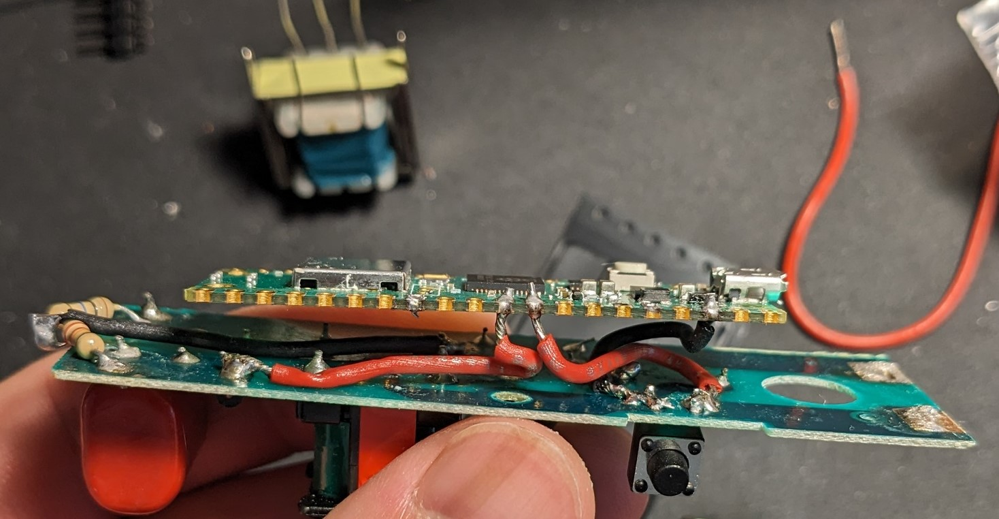

## Introduction
I hacked an existing PCB from electric bug racket and developed an algorithm for an Arduino nano to measure the amount of bugs zapped to be recorded. The motivation behind this project is to "improve" my bug racket by added a fun little feature. I also want to applied some of the electrical engineering skills I learned in school. 

I first started by understanding the how the circuit works. Below is a schematic I drew according to the PCB. It might not be 100% correct, but I still understand the big picture of how this cheap and tiny PCB can boost 3V from 2 AA cells to over 1kV.

## Circuit Explaination

Will be written soon!

## Additional feature 
(by my teammates over at [EDGE-0304](https://www.linkedin.com/company/edge-0304/about/))

To make use of the record of bug zapped, we have progamming the arduino nano to send the data to backend server for showing the zapped count on a website or mobile app that keeps track of the zap count of different users. The zapped count can be compared between users to show the ranking among users. This feature is in progress. 

