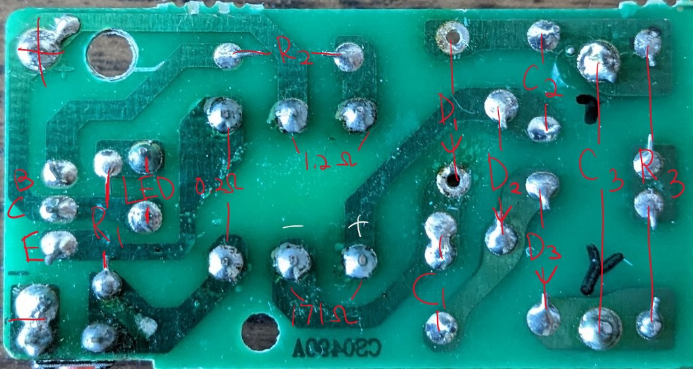
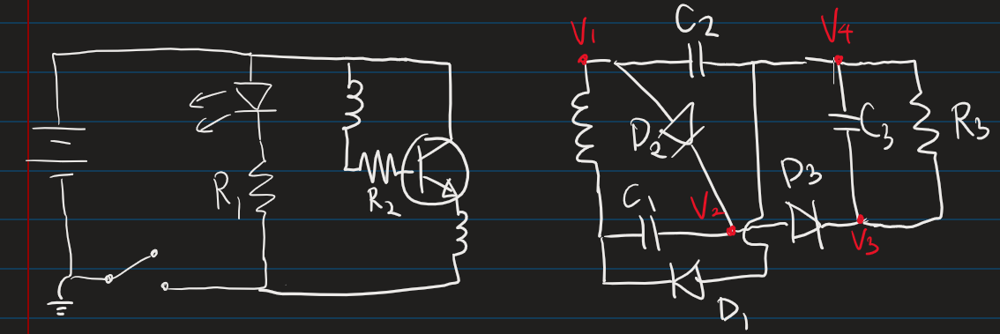
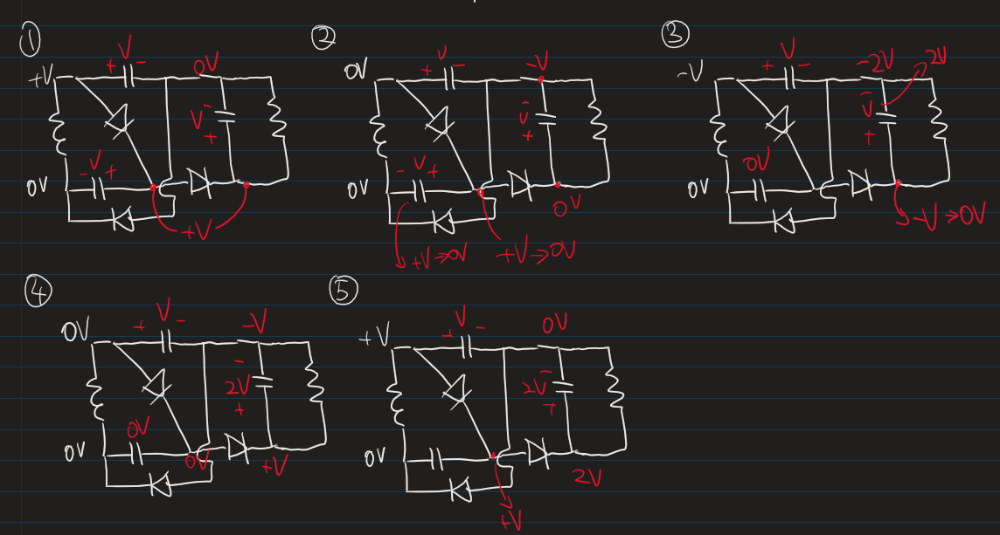

## Introduction
I hacked an existing PCB from an electric bug racket and developed an algorithm for an Arduino nano to measure the amount of bugs zapped to be recorded. The motivation behind this project is to “improve” my bug racket by added a fun little feature. I also want to apply some of the electrical engineering skills I learned in school.

I first started by understanding how the circuit works. The section below contains a schematic I drew according to the PCB. It might not be 100% correct, but I think I still understood the big picture of how this cheap and tiny PCB can boost 3V from 2 AA cells to over 1kV.

## Circuit Explanation

Although the PCB shown above is not the one I used for this project, but I have taken many bug racket apart, and I can tell that all of them are quite similar. Below is the circuit I drew according to the PCB above. The voltage defined will be helpful when we analyze it.

Let's start with the simplest parts first. The LED and R1 in parallel with the battery is just to let the user know whether the system is powered on or off. R2 is for controlling how many current is going into the base of the NPN BJT, which controls the current going into the collector and out from the emitter. The inductor in series with R2 is one of the winding in the transformer, it forms a feedback circuit with the other winding at the emitter of the BJT. The feedback circuit is responsible for generating an AC signal for the transformer to produce the high voltage. The following steps describe the process of generating the AC signal:

1. When the button is pressed, causing current to flow to R2 and the winding in series with it. However, no current will flow into the collector of the BJT.
1. When there is sufficient current flowing into the base, the collector will slowly turn on. This cause the winding at the emitter to induce more current at the base.
1. When there are more current going into the base, more current will also flow into the collector and to the emitter, which let more current to flow into the base. This keeps going on until the BJT is saturated, and the collector current no longer increases. Which causes the magnetic field collapses.
1. Once the magnetic field collapses, base current decreases. This then reduce the current to the collector and emitter.
1. When magnetic fully collapsed, the cycle restarts.

Continuing to the right side of the transformer, this high voltage side is for doubling the voltage output from the secondary winding of the transformer and rectifying (turning AC to DC). The process is showing in the picture below and described below the picture. **I assumed the diodes and capacitors are ideal, i.e. no IR drop.**

1. First, let's set the south side of the winding to be GND and start with +V at V1. Then, D2 turns on, which means V3 = +V as well. V4 will be +V for a very brief moment when the C3 acts like a short circuit, but after that V4 = 0V.
1. When V1 = 0V, V4 = -V because C2 is charged to V. This means that V3 = 0V, and C1 will be discharged to 0V. Also, V2 = 0V due to the charged C3.
1. When V1 = -V, V4 = -2V because C2 is charged to V. which means V3 = -V. However, this only last for a short time before settling down to 0 because of D3 conducting.
1. When V1 = 0V again, V4 = -V and V3 = V due to C3. And C1 is kept discharged, so V2 = 0V.
1. Finally, the cycle repeats, but we now have 2V across R3 and C3.

Keep in mind that the voltage across R3 and C3 doesn’t become 2V in just one or two cycles, it takes many more for all the capacitors to charged up and have their effects. Therefore, it is a simplify explanation

Also, if you think I made a mistake somewhere in my circuit analysis, feel free to contact me via [email](mailto:hello@marcusc.me) or [LinkedIn](https://www.linkedin.com/in/techno-marcus). 

This is my first prototype with Raspberry Pi nano.

## Additional feature 
(by my teammates over at [EDGE-0304](https://www.linkedin.com/company/edge-0304/about/))

To make use of the record of bug zapped, we have programmed the Arduino nano to send the data to backend server for showing the zapped count on a website or mobile app that keeps track of the zap count of different users. The zapped count can be compared between users to show the ranking among users. This feature is in progress.
