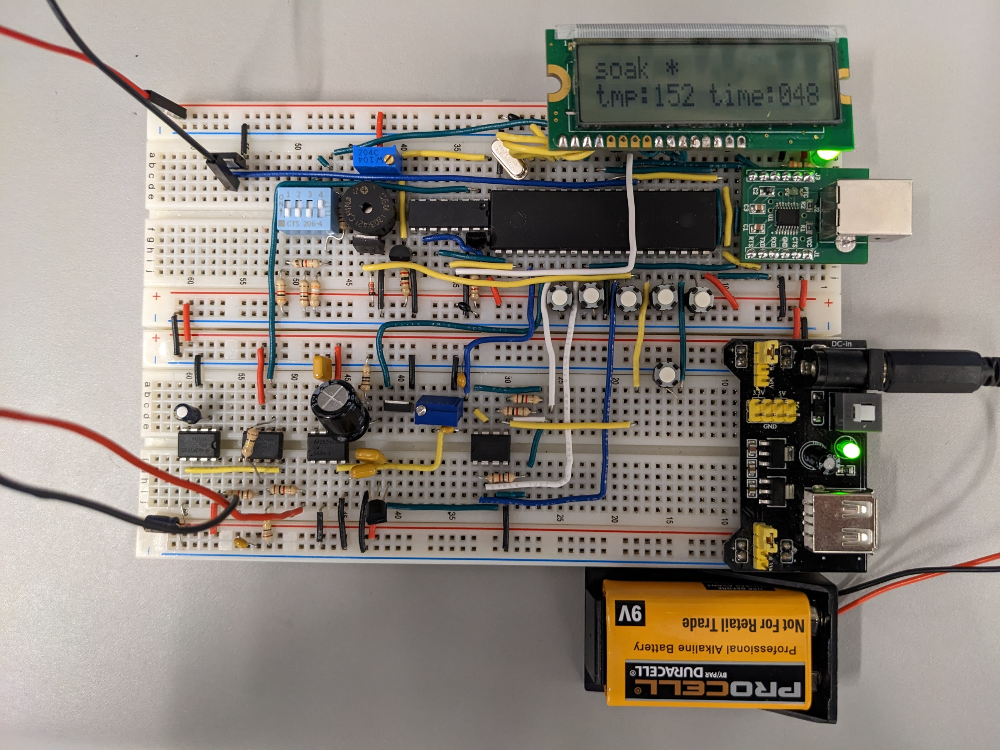
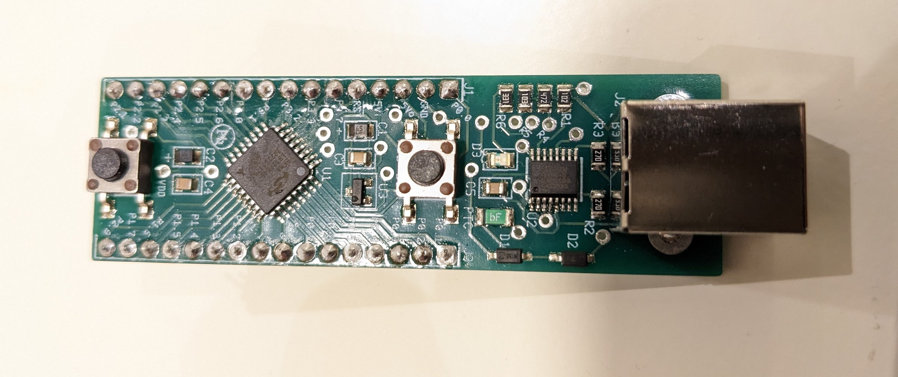

My teammates and I designed and built a reflow oven controller that controls the temperature of an oven via a PWM signal to an SSR box. The reflow parameters such as reflow temperature, reflow time and cool down temperature can be adjust. The parts we used can be found via this [link to github](https://github.com/Beluguy/Elec-291/blob/main/reflow-oven-controller).

To verify that our controller is working, we made a board using our controller. It is perfect!👌We then hand solder the header pins and the USB port to it after.

Here is our video presentation for this project.
<iframe width="560" height="315" src="https://www.youtube-nocookie.com/embed/PtcOZ4iowKk" title="YouTube video player" frameborder="0" allow="accelerometer; autoplay; clipboard-write; encrypted-media; gyroscope; picture-in-picture; web-share" allowfullscreen></iframe>