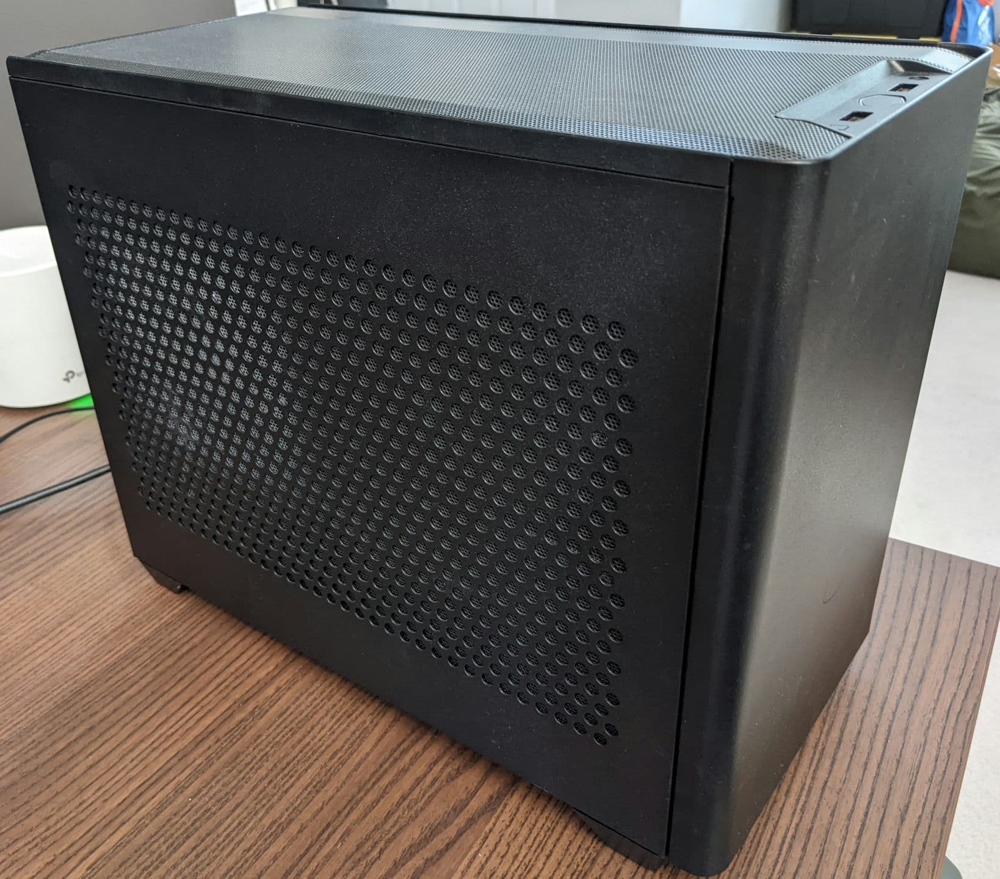
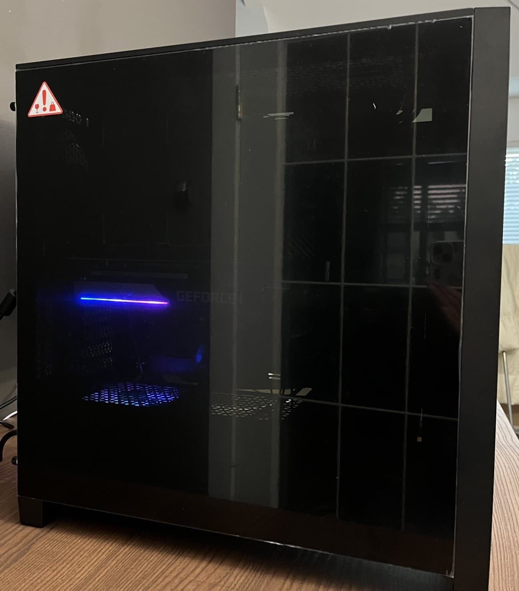

#### Why I love to build computers?
1. I love to tinker with electronics, hands-on activties, and build something useful.

1. In recent years, companies like [Apple](https://www.apple.com/newsroom/2022/03/apple-unveils-m1-ultra-the-worlds-most-powerful-chip-for-a-personal-computer/) are starting to design their own custom System on a Chip (SoC) for their desktop and laptop computers. To give some context, a SoC is a chip that contains many components of a computer. On the other hand, "traditional" computers contain separate components for each part, such as RAM, GPU, and CPU. Computers with SoCs are generally less expensive to manufacture, more efficient, take up less space. Therefore, I can imagine that in the not-so-distant future, most of the computers will use SoCs instead of having many individual components. This means that we (the consumer) probably will not be able to built computers with parts of our choosing from various manufacturers. I would like to activtely experience this change and enjoy this activity while I still can. 

1. Typically, building a computer ourselves is more cost effective than buying a pre-build computer, as you can pick the parts by yourself that suit your needs. However, this has been false😭 for the past ~2 years due to the pandemic and cryptocurrency boom, so I didn't build as much PCs as I would like to. 

#### Some computers I have built in the past (will keep updating): 

